# 3.2.2 Sơ đồ tuần tự

## 3.2.2.1 Sơ đồ tuần tự đăng ký

**Hình 3-11 Sơ đồ tuần tự đăng ký**

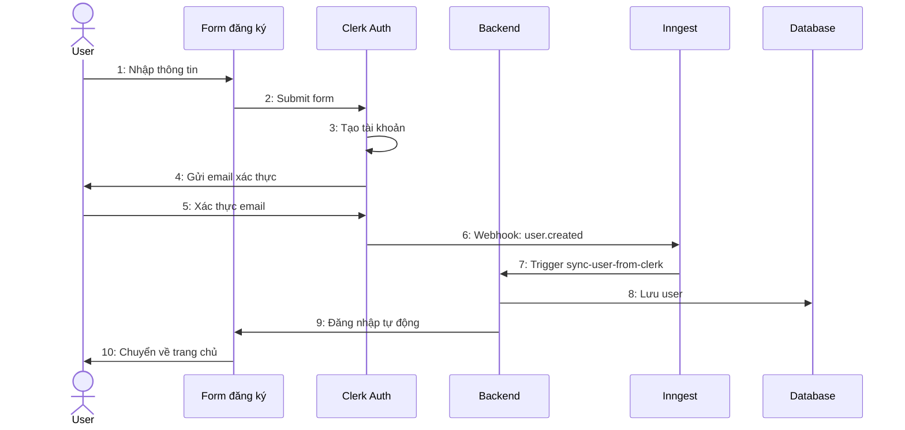
```mermaid
sequenceDiagram
    actor User
    participant Form as Form đăng ký
    participant Clerk as Clerk Auth
    participant Backend as Backend
    participant Inngest as Inngest
    participant DB as Database

    User->>Form: 1: Nhập thông tin
    Form->>Clerk: 2: Submit form
    Clerk->>Clerk: 3: Tạo tài khoản
    Clerk->>User: 4: Gửi email xác thực
    User->>Clerk: 5: Xác thực email
    Clerk->>Inngest: 6: Webhook: user.created
    Inngest->>Backend: 7: Trigger sync-user-from-clerk
    Backend->>DB: 8: Lưu user
    Backend->>Form: 9: Đăng nhập tự động
    Form->>User: 10: Chuyển về trang chủ
```

## 3.2.2.2 Sơ đồ tuần tự đăng nhập

**Hình 3-12 Sơ đồ tuần tự đăng nhập**

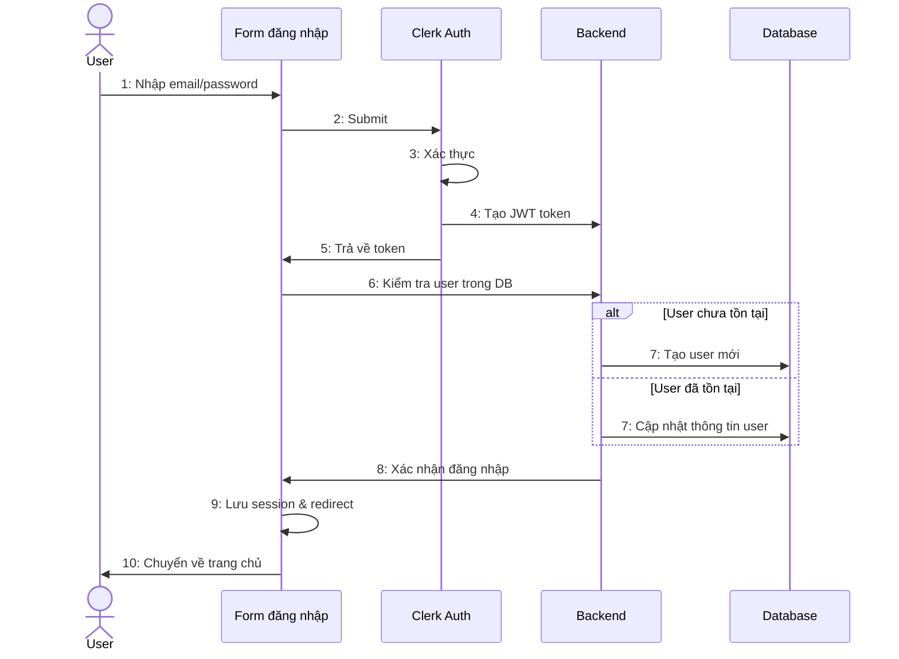
```mermaid
sequenceDiagram
    actor User
    participant Form as Form đăng nhập
    participant Clerk as Clerk Auth
    participant Backend as Backend
    participant DB as Database

    User->>Form: 1: Nhập email/password
    Form->>Clerk: 2: Submit
    Clerk->>Clerk: 3: Xác thực
    Clerk->>Backend: 4: Tạo JWT token
    Clerk->>Form: 5: Trả về token
    Form->>Backend: 6: Kiểm tra user trong DB
    alt User chưa tồn tại
        Backend->>DB: 7: Tạo user mới
    else User đã tồn tại
        Backend->>DB: 7: Cập nhật thông tin user
    end
    Backend->>Form: 8: Xác nhận đăng nhập
    Form->>Form: 9: Lưu session & redirect
    Form->>User: 10: Chuyển về trang chủ
```

## 3.2.2.3 Sơ đồ tuần tự xem danh sách phim

**Hình 3-13 Sơ đồ tuần tự xem danh sách phim**

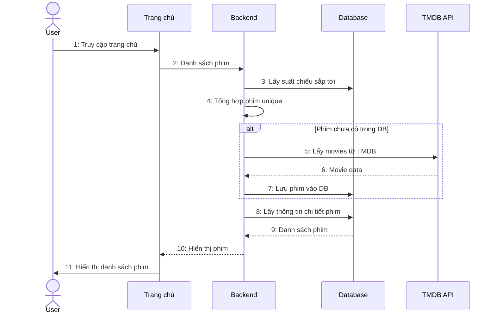
```mermaid
sequenceDiagram
    actor User
    participant TrangChu as Trang chủ
    participant Backend as Backend
    participant DB as Database
    participant TMDB as TMDB API

    User->>TrangChu: 1: Truy cập trang chủ
    TrangChu->>Backend: 2: Danh sách phim
    Backend->>DB: 3: Lấy suất chiếu sắp tới
    Backend->>Backend: 4: Tổng hợp phim unique
    alt Phim chưa có trong DB
        Backend->>TMDB: 5: Lấy movies từ TMDB
        TMDB-->>Backend: 6: Movie data
        Backend->>DB: 7: Lưu phim vào DB
    end
    Backend->>DB: 8: Lấy thông tin chi tiết phim
    DB-->>Backend: 9: Danh sách phim
    Backend-->>TrangChu: 10: Hiển thị phim
    TrangChu->>User: 11: Hiển thị danh sách phim
```

## 3.2.2.4 Sơ đồ tuần tự xem chi tiết phim

**Hình 3-14 Sơ đồ tuần tự xem chi tiết phim**

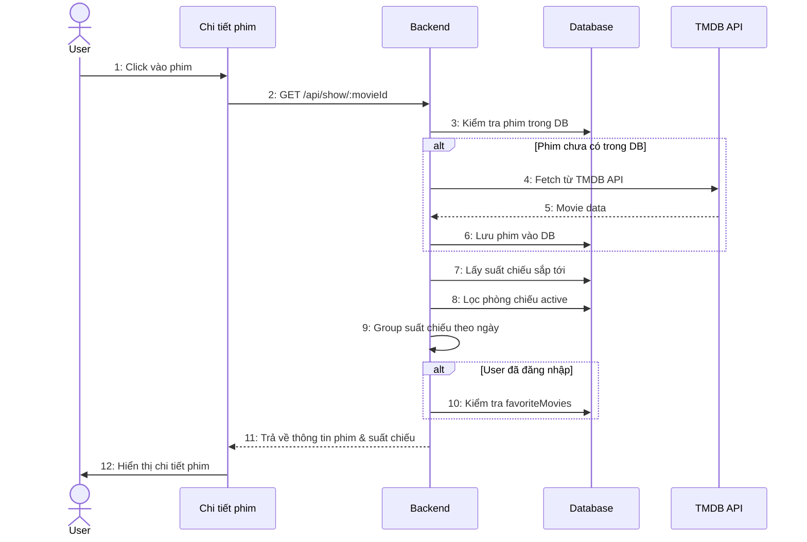
```mermaid
sequenceDiagram
    actor User
    participant ChiTiet as Chi tiết phim
    participant Backend as Backend
    participant DB as Database
    participant TMDB as TMDB API

    User->>ChiTiet: 1: Click vào phim
    ChiTiet->>Backend: 2: GET /api/show/:movieId
    Backend->>DB: 3: Kiểm tra phim trong DB
    alt Phim chưa có trong DB
        Backend->>TMDB: 4: Fetch từ TMDB API
        TMDB-->>Backend: 5: Movie data
        Backend->>DB: 6: Lưu phim vào DB
    end
    Backend->>DB: 7: Lấy suất chiếu sắp tới
    Backend->>DB: 8: Lọc phòng chiếu active
    Backend->>Backend: 9: Group suất chiếu theo ngày
    alt User đã đăng nhập
        Backend->>DB: 10: Kiểm tra favoriteMovies
    end
    Backend-->>ChiTiet: 11: Trả về thông tin phim & suất chiếu
    ChiTiet->>User: 12: Hiển thị chi tiết phim
```

## 3.2.2.5 Sơ đồ tuần tự xem trailer

**Hình 3-15 Sơ đồ tuần tự xem trailer**

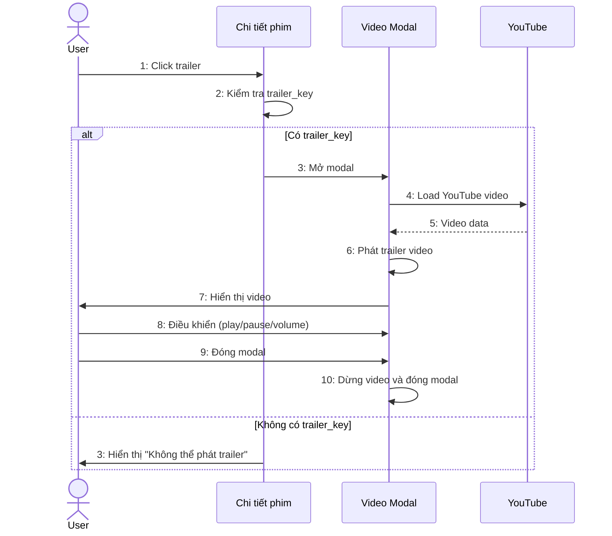
```mermaid
sequenceDiagram
    actor User
    participant ChiTiet as Chi tiết phim
    participant Modal as Video Modal
    participant YouTube as YouTube

    User->>ChiTiet: 1: Click trailer
    ChiTiet->>ChiTiet: 2: Kiểm tra trailer_key
    alt Có trailer_key
        ChiTiet->>Modal: 3: Mở modal
        Modal->>YouTube: 4: Load YouTube video
        YouTube-->>Modal: 5: Video data
        Modal->>Modal: 6: Phát trailer video
        Modal->>User: 7: Hiển thị video
        User->>Modal: 8: Điều khiển (play/pause/volume)
        User->>Modal: 9: Đóng modal
        Modal->>Modal: 10: Dừng video và đóng modal
    else Không có trailer_key
        ChiTiet->>User: 3: Hiển thị "Không thể phát trailer"
    end
```

## 3.2.2.6 Sơ đồ tuần tự chọn ghế

**Hình 3-16 Sơ đồ tuần tự chọn ghế**

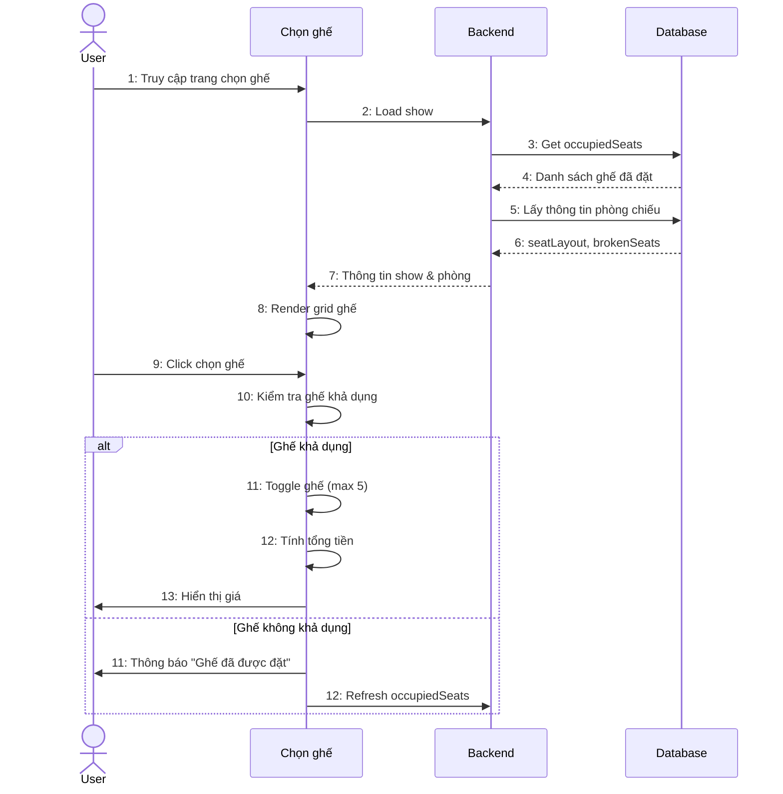
```mermaid
sequenceDiagram
    actor User
    participant ChonGhe as Chọn ghế
    participant Backend as Backend
    participant DB as Database

    User->>ChonGhe: 1: Truy cập trang chọn ghế
    ChonGhe->>Backend: 2: Load show
    Backend->>DB: 3: Get occupiedSeats
    DB-->>Backend: 4: Danh sách ghế đã đặt
    Backend->>DB: 5: Lấy thông tin phòng chiếu
    DB-->>Backend: 6: seatLayout, brokenSeats
    Backend-->>ChonGhe: 7: Thông tin show & phòng
    ChonGhe->>ChonGhe: 8: Render grid ghế
    User->>ChonGhe: 9: Click chọn ghế
    ChonGhe->>ChonGhe: 10: Kiểm tra ghế khả dụng
    alt Ghế khả dụng
        ChonGhe->>ChonGhe: 11: Toggle ghế (max 5)
        ChonGhe->>ChonGhe: 12: Tính tổng tiền
        ChonGhe->>User: 13: Hiển thị giá
    else Ghế không khả dụng
        ChonGhe->>User: 11: Thông báo "Ghế đã được đặt"
        ChonGhe->>Backend: 12: Refresh occupiedSeats
    end
```

## 3.2.2.7 Sơ đồ tuần tự lịch sử booking

**Hình 3-17 Sơ đồ tuần tự lịch sử booking**

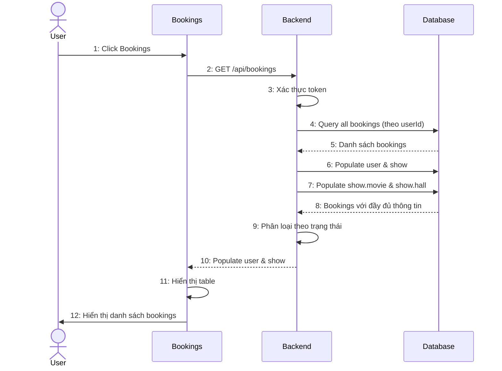
```mermaid
sequenceDiagram
    actor User
    participant Bookings as Bookings
    participant Backend as Backend
    participant DB as Database

    User->>Bookings: 1: Click Bookings
    Bookings->>Backend: 2: GET /api/bookings
    Backend->>Backend: 3: Xác thực token
    Backend->>DB: 4: Query all bookings (theo userId)
    DB-->>Backend: 5: Danh sách bookings
    Backend->>DB: 6: Populate user & show
    Backend->>DB: 7: Populate show.movie & show.hall
    DB-->>Backend: 8: Bookings với đầy đủ thông tin
    Backend->>Backend: 9: Phân loại theo trạng thái
    Backend-->>Bookings: 10: Populate user & show
    Bookings->>Bookings: 11: Hiển thị table
    Bookings->>User: 12: Hiển thị danh sách bookings
```

## 3.2.2.8 Sơ đồ tuần tự thanh toán

**Hình 3-18 Sơ đồ tuần tự thanh toán**

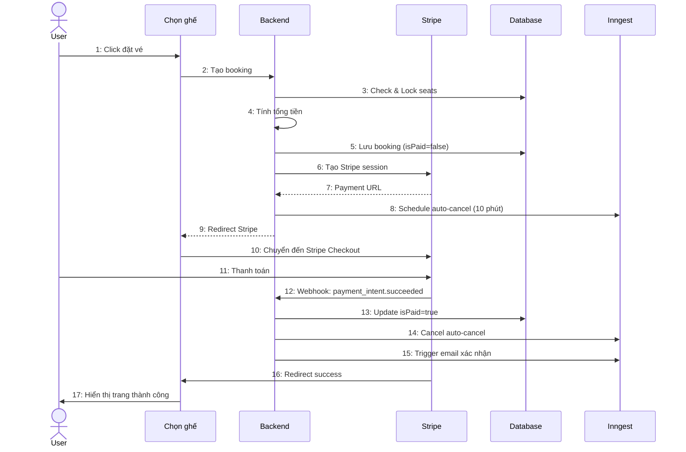
```mermaid
sequenceDiagram
    actor User
    participant ChonGhe as Chọn ghế
    participant Backend as Backend
    participant Stripe as Stripe
    participant DB as Database
    participant Inngest as Inngest

    User->>ChonGhe: 1: Click đặt vé
    ChonGhe->>Backend: 2: Tạo booking
    Backend->>DB: 3: Check & Lock seats
    Backend->>Backend: 4: Tính tổng tiền
    Backend->>DB: 5: Lưu booking (isPaid=false)
    Backend->>Stripe: 6: Tạo Stripe session
    Stripe-->>Backend: 7: Payment URL
    Backend->>Inngest: 8: Schedule auto-cancel (10 phút)
    Backend-->>ChonGhe: 9: Redirect Stripe
    ChonGhe->>Stripe: 10: Chuyển đến Stripe Checkout
    User->>Stripe: 11: Thanh toán
    Stripe->>Backend: 12: Webhook: payment_intent.succeeded
    Backend->>DB: 13: Update isPaid=true
    Backend->>Inngest: 14: Cancel auto-cancel
    Backend->>Inngest: 15: Trigger email xác nhận
    Stripe->>ChonGhe: 16: Redirect success
    ChonGhe->>User: 17: Hiển thị trang thành công
```

## 3.2.2.9 Sơ đồ tuần tự phim yêu thích

**Hình 3-19 Sơ đồ tuần tự phim yêu thích**

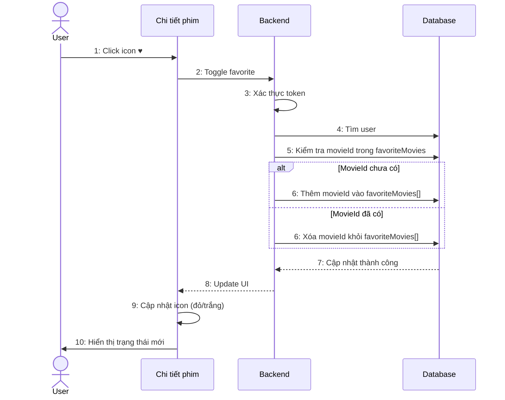
```mermaid
sequenceDiagram
    actor User
    participant ChiTiet as Chi tiết phim
    participant Backend as Backend
    participant DB as Database

    User->>ChiTiet: 1: Click icon ♥
    ChiTiet->>Backend: 2: Toggle favorite
    Backend->>Backend: 3: Xác thực token
    Backend->>DB: 4: Tìm user
    Backend->>DB: 5: Kiểm tra movieId trong favoriteMovies
    alt MovieId chưa có
        Backend->>DB: 6: Thêm movieId vào favoriteMovies[]
    else MovieId đã có
        Backend->>DB: 6: Xóa movieId khỏi favoriteMovies[]
    end
    DB-->>Backend: 7: Cập nhật thành công
    Backend-->>ChiTiet: 8: Update UI
    ChiTiet->>ChiTiet: 9: Cập nhật icon (đỏ/trắng)
    ChiTiet->>User: 10: Hiển thị trạng thái mới
```

## 3.2.2.10 Sơ đồ tuần tự danh sách suất chiếu

**Hình 3-20 Sơ đồ tuần tự danh sách suất chiếu**

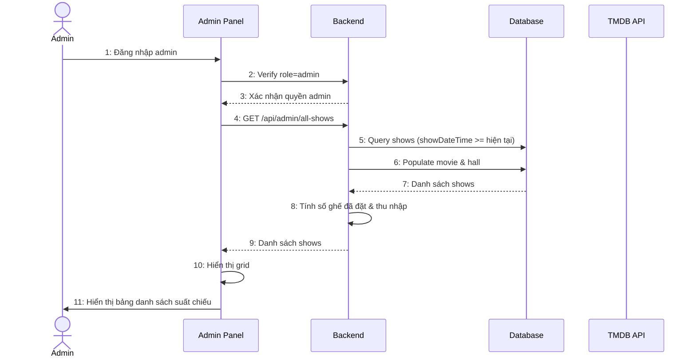
```mermaid
sequenceDiagram
    actor Admin
    participant AdminPanel as Admin Panel
    participant Backend as Backend
    participant DB as Database
    participant TMDB as TMDB API

    Admin->>AdminPanel: 1: Đăng nhập admin
    AdminPanel->>Backend: 2: Verify role=admin
    Backend-->>AdminPanel: 3: Xác nhận quyền admin
    AdminPanel->>Backend: 4: GET /api/admin/all-shows
    Backend->>DB: 5: Query shows (showDateTime >= hiện tại)
    Backend->>DB: 6: Populate movie & hall
    DB-->>Backend: 7: Danh sách shows
    Backend->>Backend: 8: Tính số ghế đã đặt & thu nhập
    Backend-->>AdminPanel: 9: Danh sách shows
    AdminPanel->>AdminPanel: 10: Hiển thị grid
    AdminPanel->>Admin: 11: Hiển thị bảng danh sách suất chiếu
```

## 3.2.2.11 Sơ đồ tuần tự tổng số booking

**Hình 3-21 Sơ đồ tuần tự tổng số booking**

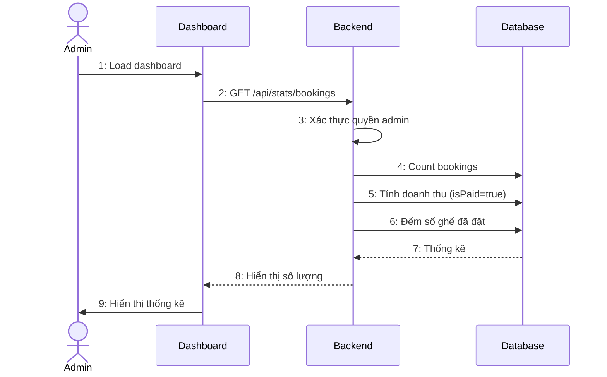
```mermaid
sequenceDiagram
    actor Admin
    participant Dashboard as Dashboard
    participant Backend as Backend
    participant DB as Database

    Admin->>Dashboard: 1: Load dashboard
    Dashboard->>Backend: 2: GET /api/stats/bookings
    Backend->>Backend: 3: Xác thực quyền admin
    Backend->>DB: 4: Count bookings
    Backend->>DB: 5: Tính doanh thu (isPaid=true)
    Backend->>DB: 6: Đếm số ghế đã đặt
    DB-->>Backend: 7: Thống kê
    Backend-->>Dashboard: 8: Hiển thị số lượng
    Dashboard->>Admin: 9: Hiển thị thống kê
```

## 3.2.2.12 Sơ đồ tuần tự thêm suất chiếu

**Hình 3-22 Sơ đồ tuần tự thêm suất chiếu**

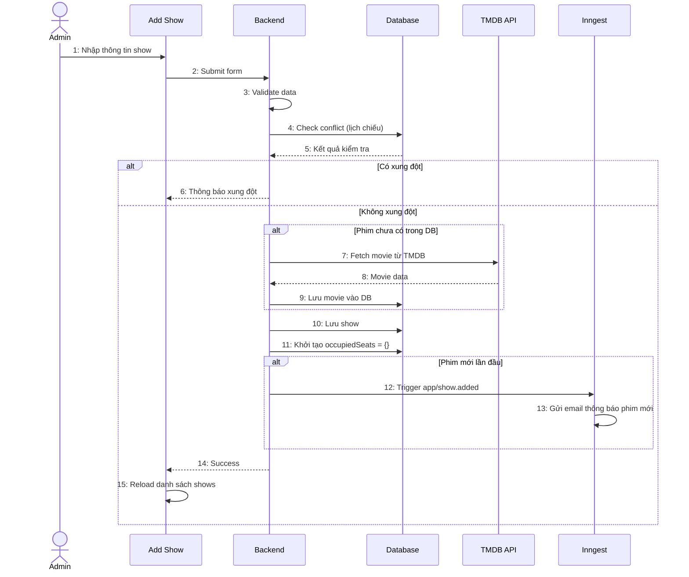
```mermaid
sequenceDiagram
    actor Admin
    participant AddShow as Add Show
    participant Backend as Backend
    participant DB as Database
    participant TMDB as TMDB API
    participant Inngest as Inngest

    Admin->>AddShow: 1: Nhập thông tin show
    AddShow->>Backend: 2: Submit form
    Backend->>Backend: 3: Validate data
    Backend->>DB: 4: Check conflict (lịch chiếu)
    DB-->>Backend: 5: Kết quả kiểm tra
    alt Có xung đột
        Backend-->>AddShow: 6: Thông báo xung đột
    else Không xung đột
        alt Phim chưa có trong DB
            Backend->>TMDB: 7: Fetch movie từ TMDB
            TMDB-->>Backend: 8: Movie data
            Backend->>DB: 9: Lưu movie vào DB
        end
        Backend->>DB: 10: Lưu show
        Backend->>DB: 11: Khởi tạo occupiedSeats = {}
        alt Phim mới lần đầu
            Backend->>Inngest: 12: Trigger app/show.added
            Inngest->>Inngest: 13: Gửi email thông báo phim mới
        end
        Backend-->>AddShow: 14: Success
        AddShow->>AddShow: 15: Reload danh sách shows
    end
```

## 3.2.2.13 Sơ đồ tuần tự hủy suất chiếu

**Hình 3-23 Sơ đồ tuần tự hủy suất chiếu**

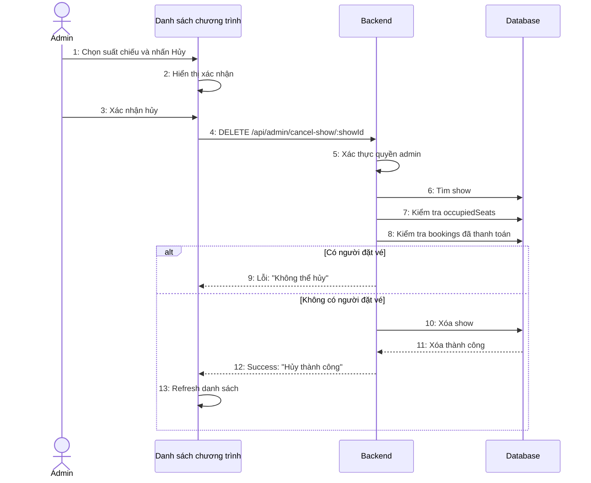
```mermaid
sequenceDiagram
    actor Admin
    participant ListShows as Danh sách chương trình
    participant Backend as Backend
    participant DB as Database

    Admin->>ListShows: 1: Chọn suất chiếu và nhấn Hủy
    ListShows->>ListShows: 2: Hiển thị xác nhận
    Admin->>ListShows: 3: Xác nhận hủy
    ListShows->>Backend: 4: DELETE /api/admin/cancel-show/:showId
    Backend->>Backend: 5: Xác thực quyền admin
    Backend->>DB: 6: Tìm show
    Backend->>DB: 7: Kiểm tra occupiedSeats
    Backend->>DB: 8: Kiểm tra bookings đã thanh toán
    alt Có người đặt vé
        Backend-->>ListShows: 9: Lỗi: "Không thể hủy"
    else Không có người đặt vé
        Backend->>DB: 10: Xóa show
        DB-->>Backend: 11: Xóa thành công
        Backend-->>ListShows: 12: Success: "Hủy thành công"
        ListShows->>ListShows: 13: Refresh danh sách
    end
```

---

# 3.2.3 Sơ đồ hoạt động

## 3.2.3.1 Sơ đồ hoạt động đăng ký

**Hình 3-24 Sơ đồ hoạt động đăng ký**

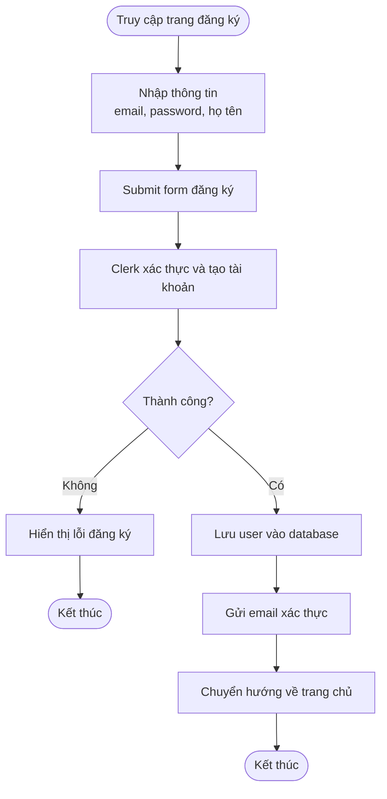
```mermaid
flowchart TD
    Start([Truy cập trang đăng ký]) --> Input[Nhập thông tin<br/>email, password, họ tên]
    Input --> Submit[Submit form đăng ký]
    Submit --> Clerk[Clerk xác thực và tạo tài khoản]
    Clerk --> Decision{Thành công?}
    Decision -->|Không| Error[Hiển thị lỗi đăng ký]
    Error --> End1([Kết thúc])
    Decision -->|Có| SaveDB[Lưu user vào database]
    SaveDB --> Email[Gửi email xác thực]
    Email --> Redirect[Chuyển hướng về trang chủ]
    Redirect --> End2([Kết thúc])
```

## 3.2.3.2 Sơ đồ hoạt động đăng nhập

**Hình 3-25 Sơ đồ hoạt động đăng nhập**

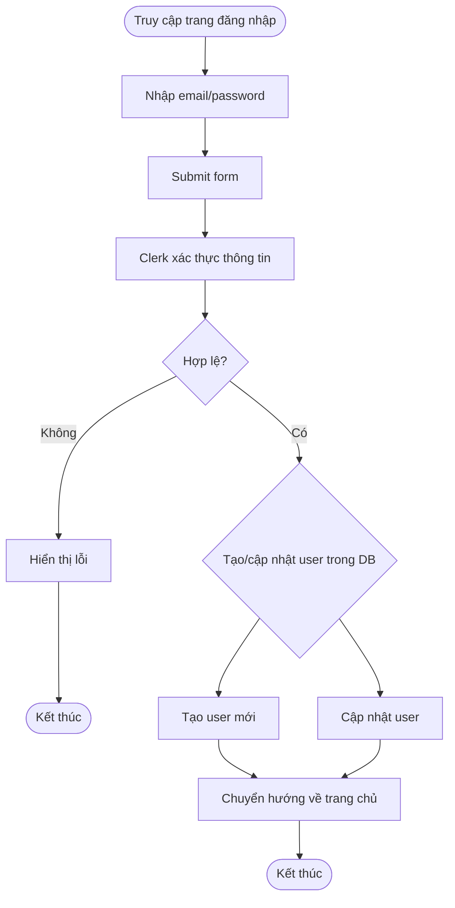
```mermaid
flowchart TD
    Start([Truy cập trang đăng nhập]) --> Input[Nhập email/password]
    Input --> Submit[Submit form]
    Submit --> Clerk[Clerk xác thực thông tin]
    Clerk --> Decision{Hợp lệ?}
    Decision -->|Không| Error[Hiển thị lỗi]
    Error --> End1([Kết thúc])
    Decision -->|Có| CheckDB{Tạo/cập nhật user trong DB}
    CheckDB --> Create[Tạo user mới]
    CheckDB --> Update[Cập nhật user]
    Create --> Redirect[Chuyển hướng về trang chủ]
    Update --> Redirect
    Redirect --> End2([Kết thúc])
```

## 3.2.3.3 Sơ đồ hoạt động xem danh sách phim

**Hình 3-26 Sơ đồ hoạt động người dùng xem danh sách phim**

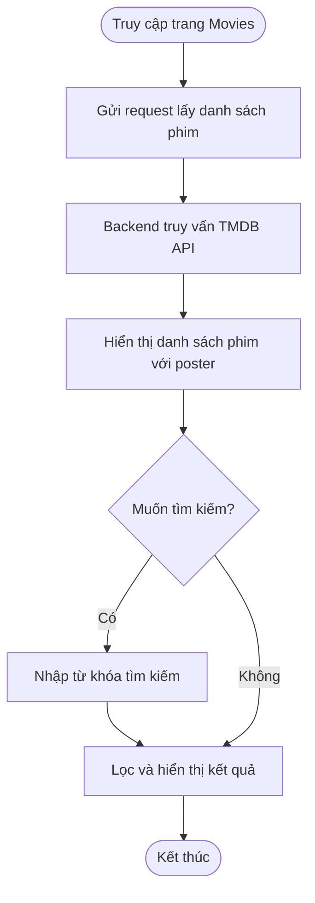
```mermaid
flowchart TD
    Start([Truy cập trang Movies]) --> Request[Gửi request lấy danh sách phim]
    Request --> Query[Backend truy vấn TMDB API]
    Query --> Display[Hiển thị danh sách phim với poster]
    Display --> Search{Muốn tìm kiếm?}
    Search -->|Có| Keyword[Nhập từ khóa tìm kiếm]
    Keyword --> Filter[Lọc và hiển thị kết quả]
    Search -->|Không| Filter
    Filter --> End([Kết thúc])
```

## 3.2.3.4 Sơ đồ hoạt động xem chi tiết phim

**Hình 3-27 Sơ đồ hoạt động xem chi tiết phim**

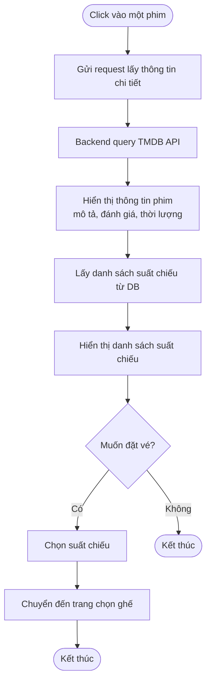
```mermaid
flowchart TD
    Start([Click vào một phim]) --> Request[Gửi request lấy thông tin chi tiết]
    Request --> TMDB[Backend query TMDB API]
    TMDB --> Display[Hiển thị thông tin phim<br/>mô tả, đánh giá, thời lượng]
    Display --> GetShows[Lấy danh sách suất chiếu từ DB]
    GetShows --> ShowShows[Hiển thị danh sách suất chiếu]
    ShowShows --> Book{Muốn đặt vé?}
    Book -->|Có| Select[Chọn suất chiếu]
    Select --> SeatPage[Chuyển đến trang chọn ghế]
    Book -->|Không| End1([Kết thúc])
    SeatPage --> End2([Kết thúc])
```

## 3.2.3.5 Sơ đồ hoạt động xem trailer

**Hình 3-28 Sơ đồ hoạt động xem trailer**

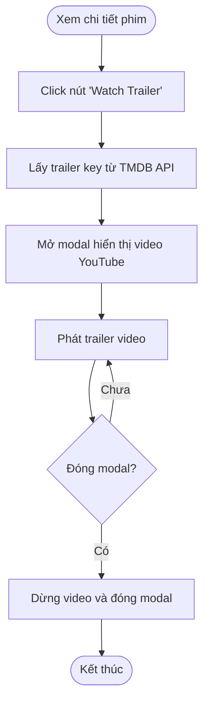
```mermaid
flowchart TD
    Start([Xem chi tiết phim]) --> Click[Click nút 'Watch Trailer']
    Click --> GetKey[Lấy trailer key từ TMDB API]
    GetKey --> Modal[Mở modal hiển thị video YouTube]
    Modal --> Play[Phát trailer video]
    Play --> Close{Đóng modal?}
    Close -->|Chưa| Play
    Close -->|Có| Stop[Dừng video và đóng modal]
    Stop --> End([Kết thúc])
```

## 3.2.3.6 Sơ đồ hoạt động chọn ghế ngồi

**Hình 3-29 Sơ đồ hoạt động chọn ghế**

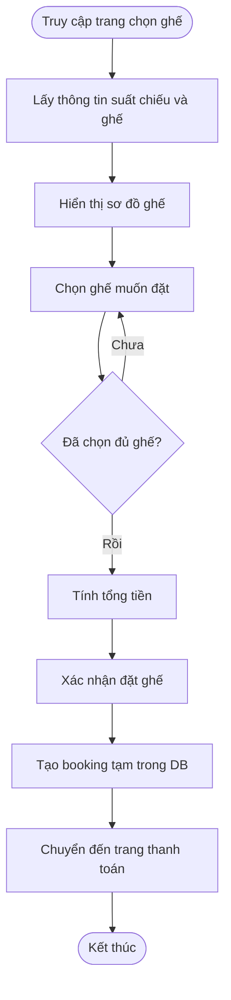
```mermaid
flowchart TD
    Start([Truy cập trang chọn ghế]) --> GetInfo[Lấy thông tin suất chiếu và ghế]
    GetInfo --> Display[Hiển thị sơ đồ ghế]
    Display --> Select[Chọn ghế muốn đặt]
    Select --> Check{Đã chọn đủ ghế?}
    Check -->|Chưa| Select
    Check -->|Rồi| Calculate[Tính tổng tiền]
    Calculate --> Confirm[Xác nhận đặt ghế]
    Confirm --> Create[Tạo booking tạm trong DB]
    Create --> Payment[Chuyển đến trang thanh toán]
    Payment --> End([Kết thúc])
```

## 3.2.3.7 Sơ đồ hoạt động lịch sử đặt vé

**Hình 3-30 Sơ đồ hoạt động lịch sử đặt vé**

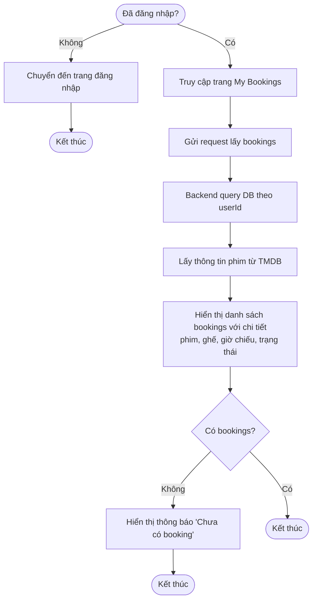
```mermaid
flowchart TD
    Start([Đã đăng nhập?]) -->|Không| Login[Chuyển đến trang đăng nhập]
    Login --> End1([Kết thúc])
    Start -->|Có| Access[Truy cập trang My Bookings]
    Access --> Request[Gửi request lấy bookings]
    Request --> Query[Backend query DB theo userId]
    Query --> TMDB[Lấy thông tin phim từ TMDB]
    TMDB --> Display[Hiển thị danh sách bookings với chi tiết<br/>phim, ghế, giờ chiếu, trạng thái]
    Display --> Check{Có bookings?}
    Check -->|Không| NoBooking[Hiển thị thông báo 'Chưa có booking']
    Check -->|Có| End2([Kết thúc])
    NoBooking --> End3([Kết thúc])
```

## 3.2.3.8 Sơ đồ hoạt động thanh toán

**Hình 3-31 Sơ đồ hoạt động thanh toán**

```mermaid
flowchart TD
    Start([Hiển thị thông tin booking]) --> Method[Chọn phương thức thanh toán]
    Method --> CreateSession[Tạo Stripe checkout session]
    CreateSession --> Redirect[Chuyển hướng đến Stripe]
    Redirect --> Input[Nhập thông tin thẻ]
    Input --> Confirm[Xác nhận thanh toán]
    Confirm --> Success{Thanh toán thành công?}
    Success -->|Không| Error[Hiển thị lỗi thanh toán]
    Error --> End1([Kết thúc])
    Success -->|Có| Webhook[Stripe gửi webhook đến backend]
    Webhook --> Update[Cập nhật trạng thái booking]
    Update --> Email[Gửi email xác nhận]
    Email --> ConfirmPage[Chuyển về trang xác nhận]
    ConfirmPage --> End2([Kết thúc])
```

## 3.2.3.9 Sơ đồ hoạt động phim yêu thích

**Hình 3-32 Sơ đồ hoạt động phim yêu thích**

```mermaid
flowchart TD
    Start([Xem chi tiết phim]) --> Check{Đã đăng nhập?}
    Check -->|Không| Login[Chuyển đến trang đăng nhập]
    Login --> End1([Kết thúc])
    Check -->|Có| Click[Click nút 'Add to Favorites']
    Click --> Request[Gửi request thêm vào favorite]
    Request --> Update[Cập nhật favoriteMovies trong DB]
    Update --> Notify[Hiển thị thông báo thành công]
    Notify --> Icon[Cập nhật icon yêu thích]
    Icon --> ViewList{Xem danh sách?}
    ViewList -->|Có| FavoritesPage[Truy cập trang Favorites]
    FavoritesPage --> Display[Hiển thị danh sách phim yêu thích]
    ViewList -->|Không| End2([Kết thúc])
    Display --> End3([Kết thúc])
```

## 3.2.3.10 Sơ đồ hoạt động admin xem lịch sử booking

**Hình 3-33 Sơ đồ hoạt động admin xem lịch sử booking**

```mermaid
flowchart TD
    Start([Là Admin?]) -->|Không| Deny[Từ chối truy cập]
    Deny --> End1([Kết thúc])
    Start -->|Có| Access[Truy cập trang List Bookings]
    Access --> Request[Gửi request lấy tất cả bookings]
    Request --> Query[Backend query DB và populate dữ liệu<br/>show, user, movie]
    Query --> Display[Hiển thị bảng bookings<br/>user, phim, ghế, ngày, trạng thái, giá]
    Display --> Filter{Muốn lọc theo ngày?}
    Filter -->|Có| SelectDate[Chọn ngày và lọc danh sách]
    SelectDate --> Result[Hiển thị kết quả đã lọc]
    Filter -->|Không| Result
    Result --> End2([Kết thúc])
```

## 3.2.3.11 Sơ đồ hoạt động admin xem danh sách phim

**Hình 3-34 Sơ đồ hoạt động admin xem danh sách phim**

```mermaid
flowchart TD
    Start([Là Admin?]) -->|Không| Deny[Từ chối truy cập]
    Deny --> End1([Kết thúc])
    Start -->|Có| Dashboard[Truy cập trang Admin Dashboard]
    Dashboard --> Request[Gửi request lấy danh sách shows]
    Request --> Query[Backend query DB và populate<br/>với thông tin TMDB]
    Query --> Display[Hiển thị bảng danh sách shows<br/>phim, ngày, giờ, giá]
    Display --> Action{Muốn chỉnh sửa/xóa?}
    Action -->|Có| Manage[Thao tác quản lý show]
    Action -->|Không| End2([Kết thúc])
    Manage --> End3([Kết thúc])
```

## 3.2.3.12 Sơ đồ hoạt động xem tổng số booking

**Hình 3-35 Sơ đồ hoạt động admin xem tổng số booking**

```mermaid
flowchart TD
    Start([Là Admin?]) -->|Không| Deny[Từ chối truy cập]
    Deny --> End1([Kết thúc])
    Start -->|Có| Dashboard[Truy cập Dashboard]
    Dashboard --> Request[Gửi request lấy thống kê bookings]
    Request --> Count[Backend tính toán tổng số bookings]
    Count --> Revenue[Backend tính doanh thu tổng]
    Revenue --> Time[Backend phân tích theo thời gian]
    Time --> Display[Hiển thị thống kê trên Dashboard<br/>số lượng, doanh thu, biểu đồ]
    Display --> End2([Kết thúc])
```

## 3.2.3.13 Sơ đồ hoạt động admin thêm suất chiếu

**Hình 3-36 Sơ đồ hoạt động admin thêm suất chiếu**

```mermaid
flowchart TD
    Start([Là Admin?]) -->|Không| Deny[Từ chối truy cập]
    Deny --> End1([Kết thúc])
    Start -->|Có| Access[Truy cập trang Add Shows]
    Access --> Select[Chọn phim từ danh sách TMDB]
    Select --> Input[Nhập thông tin suất chiếu<br/>ngày, giờ, giá vé]
    Input --> Submit[Submit form]
    Submit --> Validate{Dữ liệu hợp lệ?}
    Validate -->|Không| Error[Hiển thị lỗi validation]
    Error --> End2([Kết thúc])
    Validate -->|Có| Create[Tạo show mới trong DB]
    Create --> Init[Khởi tạo sơ đồ ghế seats]
    Init --> Success[Hiển thị thông báo thành công]
    Success --> Reload[Reload danh sách shows]
    Reload --> End3([Kết thúc])
```

