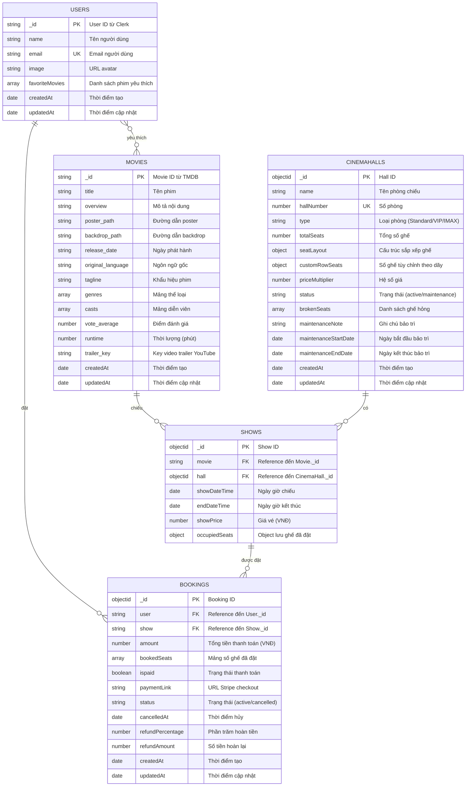
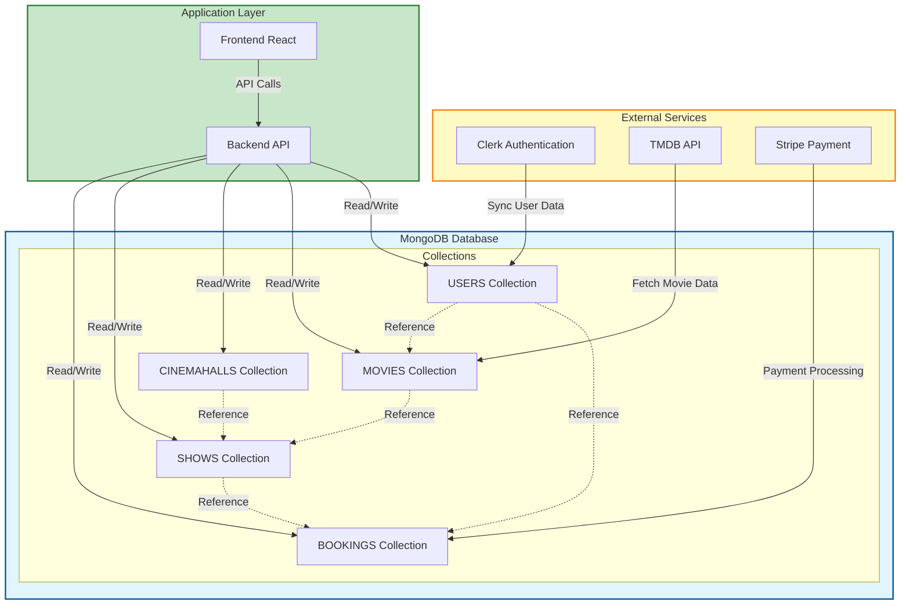

# Chương 3. THIẾT KẾ

## 3.1 Mô hình dữ liệu

### 3.1.1 Sơ đồ thực thể - mối liên kết (ERD)



### 3.1.2 Sơ đồ mức luận lý



### 3.1.3 Mô tả các loại thực thể

#### Collection: USERS

**Mô tả:** Loại thực thể USERS lưu trữ thông tin người dùng của hệ thống. Dữ liệu được đồng bộ tự động từ Clerk qua Inngest webhooks.

| Thuộc tính | Kiểu | K | U | M | Diễn giải |
|------------|------|---|---|---|-----------|
| _id | String | x | x | x | User ID từ Clerk (Primary Key) |
| name | String |   |   | x | Tên người dùng |
| email | String |   | x | x | Email người dùng (Unique) |
| image | String |   |   | x | URL avatar người dùng |
| favoriteMovies | Array[String] |   |   |   | Mảng ID phim yêu thích (Reference đến Movie._id) |
| createdAt | Date |   |   | x | Thời điểm tạo record (Auto) |
| updatedAt | Date |   |   | x | Thời điểm cập nhật record (Auto) |

**Ghi chú:**
- K: Khóa (Key)
- U: Unique
- M: Mandatory (Bắt buộc)
- Dữ liệu được đồng bộ tự động từ Clerk khi user đăng ký/cập nhật
- favoriteMovies là mảng các Movie._id mà user đã đánh dấu yêu thích

---

#### Collection: MOVIES

**Mô tả:** Loại thực thể MOVIES lưu trữ thông tin phim được lấy từ TMDB API. Mỗi phim có thể có nhiều suất chiếu (SHOWS).

| Thuộc tính | Kiểu | K | U | M | Diễn giải |
|------------|------|---|---|---|-----------|
| _id | String | x | x | x | Movie ID từ TMDB (Primary Key) |
| title | String |   |   | x | Tên phim |
| overview | String |   |   | x | Mô tả nội dung phim |
| poster_path | String |   |   | x | Đường dẫn poster (TMDB) |
| backdrop_path | String |   |   | x | Đường dẫn backdrop (TMDB) |
| release_date | String |   |   | x | Ngày phát hành (YYYY-MM-DD) |
| original_language | String |   |   |   | Ngôn ngữ gốc (en, vi, etc) |
| tagline | String |   |   |   | Khẩu hiệu phim |
| genres | Array |   |   | x | Mảng thể loại [{id, name}] |
| casts | Array |   |   | x | Mảng diễn viên [{id, name, character, profile_path}] |
| vote_average | Number |   |   | x | Điểm đánh giá trung bình (0-10) |
| runtime | Number |   |   | x | Thời lượng phim (phút) |
| trailer_key | String |   |   |   | Key video trailer YouTube |
| createdAt | Date |   |   | x | Thời điểm tạo record (Auto) |
| updatedAt | Date |   |   | x | Thời điểm cập nhật record (Auto) |

**Ghi chú:**
- Dữ liệu được lấy từ TMDB API
- Mỗi phim có thể có nhiều suất chiếu (1-N relationship với SHOWS)
- trailer_key được cập nhật thủ công hoặc tự động từ TMDB API

---

#### Collection: CINEMAHALLS

**Mô tả:** Loại thực thể CINEMAHALLS lưu trữ thông tin các phòng chiếu trong rạp. Mỗi phòng có cấu trúc ghế và giá vé riêng.

| Thuộc tính | Kiểu | K | U | M | Diễn giải |
|------------|------|---|---|---|-----------|
| _id | ObjectId | x |   | x | Hall ID (MongoDB generated, Primary Key) |
| name | String |   |   | x | Tên phòng chiếu |
| hallNumber | Number |   | x | x | Số phòng (Unique) |
| type | String |   |   | x | Loại phòng: Standard, VIP, IMAX |
| totalSeats | Number |   |   | x | Tổng số ghế trong phòng |
| seatLayout | Object |   |   | x | Cấu trúc sắp xếp ghế |
|   - rows | Array[String] |   |   | x | Mảng tên dãy ghế: ["A", "B", "C", ...] |
|   - seatsPerRow | Number |   |   | x | Số ghế mặc định mỗi dãy |
|   - coupleSeatsRows | Array[String] |   |   |   | Dãy có ghế đôi: ["L"] |
|   - layoutType | String |   |   |   | Kiểu layout: 'default', 'single-column', 'two-columns', 'theater-v' |
| customRowSeats | Object |   |   |   | Số ghế tùy chỉnh theo dãy: {"L": 6} |
| priceMultiplier | Number |   |   |   | Hệ số giá (VIP: 1.5, IMAX: 2, Default: 1) |
| status | String |   |   |   | Trạng thái: 'active', 'maintenance' (Default: 'active') |
| brokenSeats | Array[String] |   |   |   | Danh sách ghế hỏng: ["A1", "B5", "C10"] |
| maintenanceNote | String |   |   |   | Ghi chú bảo trì |
| maintenanceStartDate | Date |   |   |   | Ngày bắt đầu bảo trì |
| maintenanceEndDate | Date |   |   |   | Ngày kết thúc bảo trì dự kiến |
| createdAt | Date |   |   | x | Thời điểm tạo record (Auto) |
| updatedAt | Date |   |   | x | Thời điểm cập nhật record (Auto) |

**Ghi chú:**
- Mỗi phòng chiếu có thể có nhiều suất chiếu (1-N relationship với SHOWS)
- priceMultiplier được dùng để tính giá vé: giá cuối = showPrice × priceMultiplier
- Khi status = 'maintenance', không thể đặt vé cho các suất chiếu trong phòng đó

---

#### Collection: SHOWS

**Mô tả:** Loại thực thể SHOWS lưu trữ thông tin các suất chiếu phim. Mỗi suất chiếu thuộc về một phim và một phòng chiếu cụ thể.

| Thuộc tính | Kiểu | K | U | M | Diễn giải |
|------------|------|---|---|---|-----------|
| _id | ObjectId | x |   | x | Show ID (MongoDB generated, Primary Key) |
| movie | String |   |   | x | Reference đến Movie._id (Foreign Key) |
| hall | ObjectId |   |   | x | Reference đến CinemaHall._id (Foreign Key) |
| showDateTime | Date |   |   | x | Ngày giờ chiếu (ISO DateTime) |
| endDateTime | Date |   |   | x | Ngày giờ kết thúc (ISO DateTime) |
| showPrice | Number |   |   | x | Giá vé cơ bản (VNĐ) |
| occupiedSeats | Object |   |   |   | Object lưu ghế đã đặt {seatId: userId} |

**Cấu trúc occupiedSeats:**
```javascript
{
  "A1": "user_clerk_id_1",
  "A2": "user_clerk_id_1",
  "B5": "user_clerk_id_2",
  ...
}
```

**Ghi chú:**
- Mỗi suất chiếu thuộc về một phim (N-1 relationship với MOVIES)
- Mỗi suất chiếu thuộc về một phòng chiếu (N-1 relationship với CINEMAHALLS)
- Mỗi suất chiếu có thể có nhiều đặt chỗ (1-N relationship với BOOKINGS)
- occupiedSeats: Key là tên ghế (ví dụ: "A1", "B5"), Value là User ID đã đặt ghế đó
- minimize: false để giữ nguyên structure của occupiedSeats kể cả khi rỗng

---

#### Collection: BOOKINGS

**Mô tả:** Loại thực thể BOOKINGS lưu trữ thông tin đặt vé của người dùng. Mỗi booking thuộc về một user và một suất chiếu cụ thể.

| Thuộc tính | Kiểu | K | U | M | Diễn giải |
|------------|------|---|---|---|-----------|
| _id | ObjectId | x |   | x | Booking ID (MongoDB generated, Primary Key) |
| user | String |   |   | x | Reference đến User._id (Foreign Key) |
| show | String |   |   | x | Reference đến Show._id (Foreign Key) |
| amount | Number |   |   | x | Tổng tiền thanh toán (VNĐ) |
| bookedSeats | Array[String] |   |   | x | Mảng số ghế đã đặt: ["A1", "A2", "B5"] |
| ispaid | Boolean |   |   |   | Trạng thái thanh toán (Default: false) |
| paymentLink | String |   |   |   | URL Stripe checkout session |
| status | String |   |   |   | Trạng thái: 'active', 'cancelled' (Default: 'active') |
| cancelledAt | Date |   |   |   | Thời điểm hủy đặt chỗ |
| refundPercentage | Number |   |   |   | Phần trăm hoàn tiền (0-100) |
| refundAmount | Number |   |   |   | Số tiền hoàn lại (VNĐ) |
| createdAt | Date |   |   | x | Thời điểm tạo booking (Auto) |
| updatedAt | Date |   |   | x | Thời điểm cập nhật booking (Auto) |

**Ghi chú:**
- Mỗi booking thuộc về một user (N-1 relationship với USERS)
- Mỗi booking thuộc về một suất chiếu (N-1 relationship với SHOWS)
- Khi tạo booking, ispaid = false, sau khi thanh toán thành công qua Stripe → ispaid = true
- Nếu booking không được thanh toán sau 10 phút, hệ thống tự động xóa booking và giải phóng ghế
- Khi hủy booking, status = 'cancelled' và ghi nhận thông tin hoàn tiền

---

## 3.1.4 Mối quan hệ giữa các thực thể

### Quan hệ 1-N (Một - Nhiều)

1. **MOVIES → SHOWS**: Một phim có thể có nhiều suất chiếu
   - Foreign Key: `SHOWS.movie` → `MOVIES._id`

2. **CINEMAHALLS → SHOWS**: Một phòng chiếu có thể có nhiều suất chiếu
   - Foreign Key: `SHOWS.hall` → `CINEMAHALLS._id`

3. **USERS → BOOKINGS**: Một người dùng có thể có nhiều đặt chỗ
   - Foreign Key: `BOOKINGS.user` → `USERS._id`

4. **SHOWS → BOOKINGS**: Một suất chiếu có thể có nhiều đặt chỗ
   - Foreign Key: `BOOKINGS.show` → `SHOWS._id`

### Quan hệ N-N (Nhiều - Nhiều)

1. **USERS ↔ MOVIES**: Nhiều người dùng có thể yêu thích nhiều phim
   - Được lưu trong `USERS.favoriteMovies` (Array of Movie._id)

---

## 3.1.5 Ràng buộc dữ liệu

### Ràng buộc khóa chính (Primary Key)
- `USERS._id`: String, Unique, Not Null
- `MOVIES._id`: String, Unique, Not Null
- `CINEMAHALLS._id`: ObjectId, Unique, Not Null
- `SHOWS._id`: ObjectId, Unique, Not Null
- `BOOKINGS._id`: ObjectId, Unique, Not Null

### Ràng buộc khóa ngoại (Foreign Key)
- `SHOWS.movie` → `MOVIES._id` (Not Null)
- `SHOWS.hall` → `CINEMAHALLS._id` (Not Null)
- `BOOKINGS.user` → `USERS._id` (Not Null)
- `BOOKINGS.show` → `SHOWS._id` (Not Null)

### Ràng buộc duy nhất (Unique)
- `USERS.email`: Unique
- `CINEMAHALLS.hallNumber`: Unique

### Ràng buộc kiểm tra (Check Constraints)
- `BOOKINGS.status`: Chỉ nhận giá trị 'active' hoặc 'cancelled'
- `CINEMAHALLS.status`: Chỉ nhận giá trị 'active' hoặc 'maintenance'
- `CINEMAHALLS.type`: Chỉ nhận giá trị 'Standard', 'VIP', hoặc 'IMAX'
- `BOOKINGS.amount`: Phải > 0
- `SHOWS.showPrice`: Phải > 0
- `CINEMAHALLS.priceMultiplier`: Phải > 0

---

## 3.1.6 Chỉ mục (Indexes)

### Indexes được tạo tự động
- `_id`: Primary key index (tự động)
- `USERS.email`: Unique index
- `CINEMAHALLS.hallNumber`: Unique index

### Indexes được khuyến nghị
- `SHOWS.movie`: Index để tìm kiếm suất chiếu theo phim
- `SHOWS.showDateTime`: Index để sắp xếp suất chiếu theo thời gian
- `BOOKINGS.user`: Index để tìm kiếm đặt chỗ theo user
- `BOOKINGS.show`: Index để tìm kiếm đặt chỗ theo suất chiếu
- `BOOKINGS.ispaid`: Index để lọc booking đã thanh toán
- `SHOWS.hall`: Index để tìm kiếm suất chiếu theo phòng

