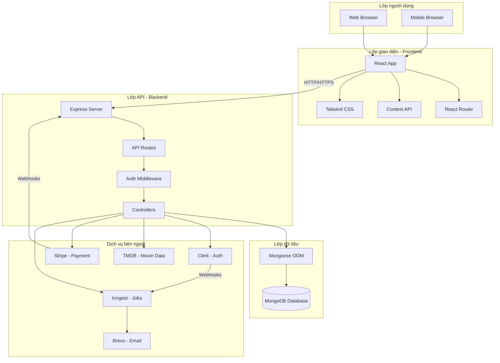
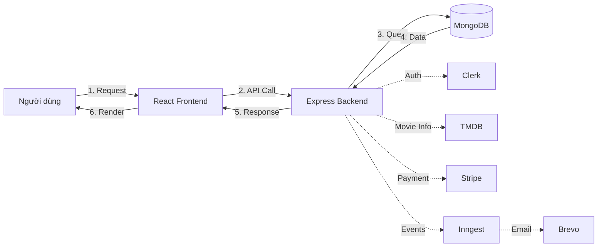
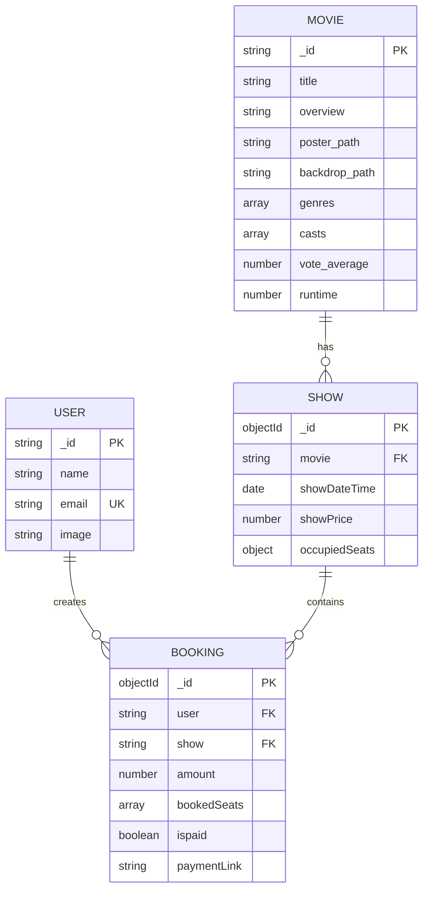
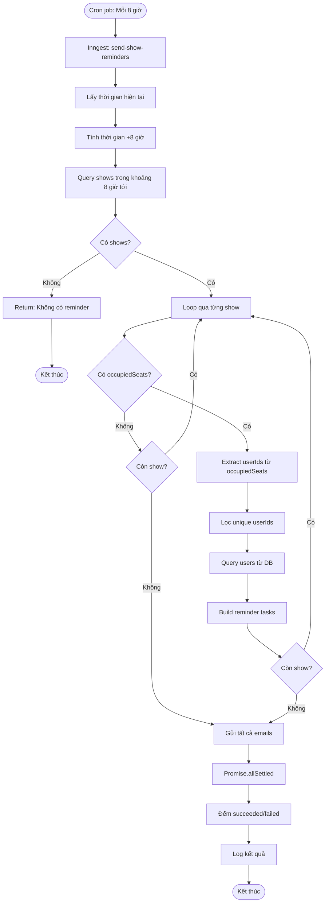
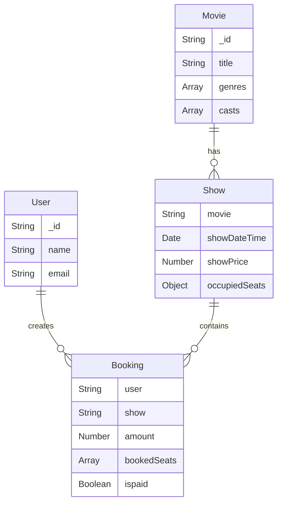
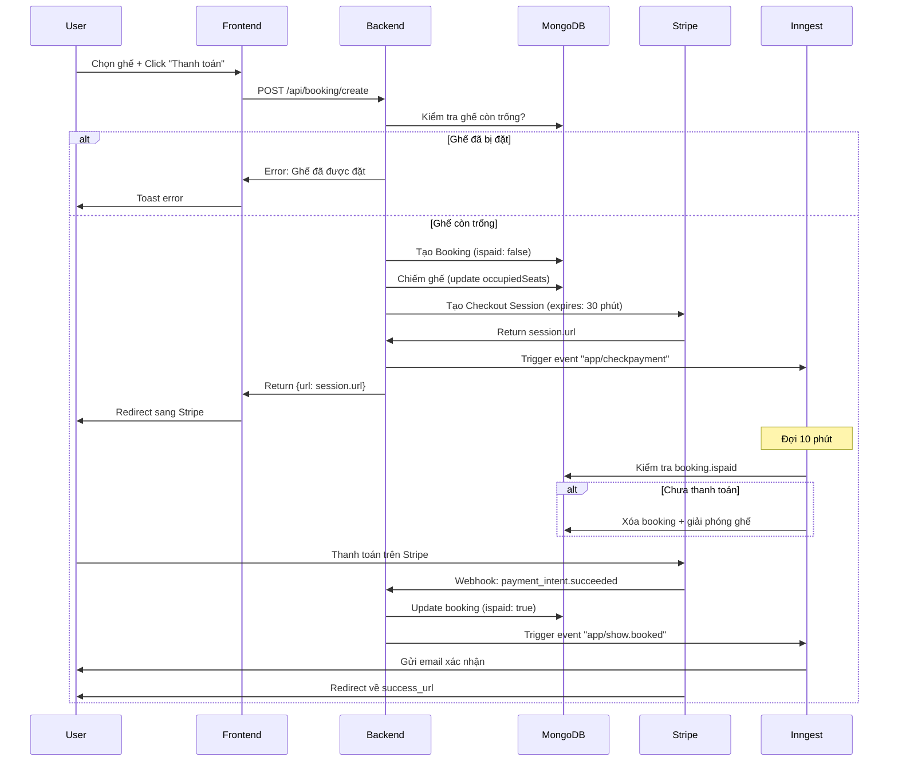
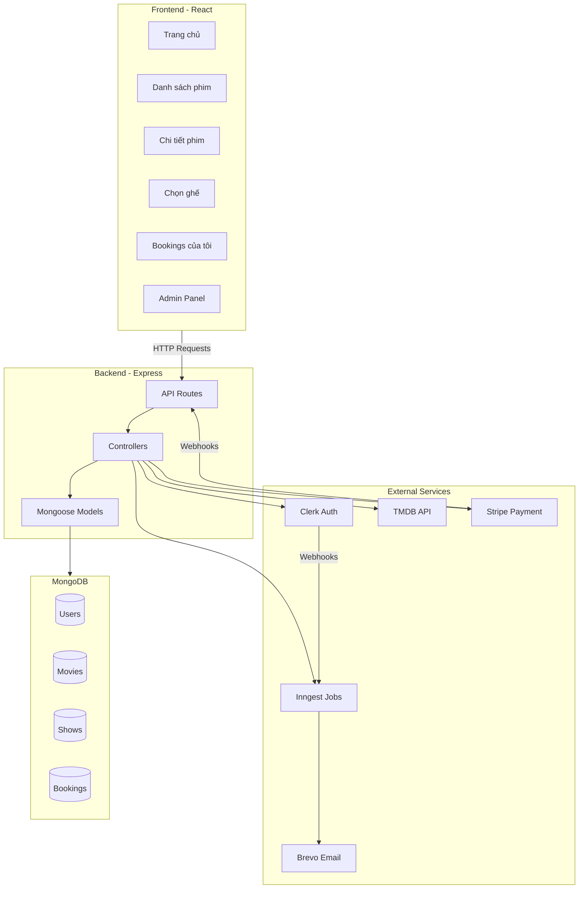
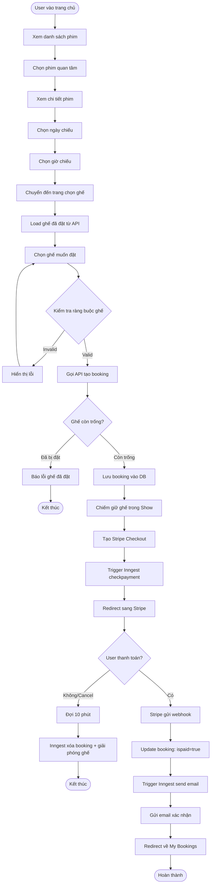
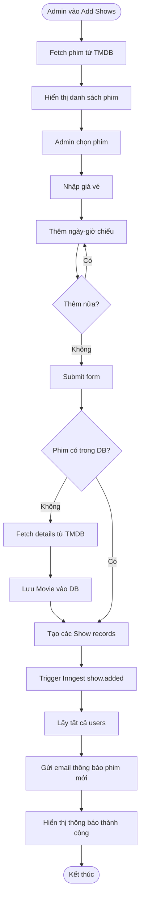

# MÔ HÌNH RẠP PHIM VÀ CHỨC NĂNG NGHIỆP VỤ

## 📋 GIỚI THIỆU

Tài liệu này mô tả chi tiết mô hình rạp phim của hệ thống đặt vé xem phim **QuickShow**, bao gồm cấu trúc phòng chiếu, quản lý ghế ngồi, và các quy trình nghiệp vụ.

---

## 🎯 1. MỤC TIÊU

### 1.1. Mục tiêu tổng quan

Xây dựng hệ thống đặt vé xem phim trực tuyến **QuickShow** nhằm:

- **Số hóa quy trình đặt vé**: Thay thế việc đặt vé thủ công tại quầy bằng hệ thống đặt vé trực tuyến hiện đại
- **Tối ưu trải nghiệm người dùng**: Cho phép khách hàng xem lịch chiếu, chọn ghế và thanh toán mọi lúc mọi nơi
- **Tự động hóa vận hành**: Giảm thiểu công việc thủ công cho nhân viên, tự động hóa các tác vụ như gửi email, quản lý ghế, hủy booking
- **Quản lý tập trung**: Cung cấp công cụ quản trị toàn diện cho admin về suất chiếu, đặt vé và doanh thu

### 1.2. Mục tiêu cụ thể

#### Về nghiệp vụ:
- ✅ Cho phép người dùng đặt vé online 24/7
- ✅ Tích hợp thanh toán trực tuyến an toàn qua Stripe
- ✅ Tự động gửi email xác nhận và nhắc nhở
- ✅ Quản lý ghế ngồi realtime, tránh đặt trùng
- ✅ Cung cấp thông tin phim phong phú từ TMDB
- ✅ Cho phép admin quản lý suất chiếu dễ dàng

#### Về kỹ thuật:
- ✅ Xây dựng kiến trúc fullstack hiện đại (React + Node.js + MongoDB)
- ✅ Tích hợp các dịch vụ bên thứ ba (Clerk, Stripe, Inngest, Brevo, TMDB)
- ✅ Áp dụng background jobs để xử lý bất đồng bộ
- ✅ Đảm bảo bảo mật với JWT authentication
- ✅ Responsive design cho mọi thiết bị

#### Về người dùng:
- ✅ Giao diện thân thiện, dễ sử dụng
- ✅ Quy trình đặt vé nhanh chóng (< 3 phút)
- ✅ Thông báo rõ ràng về trạng thái booking
- ✅ Quản lý lịch sử đặt vé cá nhân

---

## 📐 2. PHẠM VI

### 2.1. Trong phạm vi dự án

#### Chức năng đã triển khai:

**Người dùng:**
- ✅ Xem danh sách phim đang chiếu
- ✅ Xem chi tiết phim (thông tin, diễn viên, trailer)
- ✅ Xem lịch chiếu theo ngày và giờ
- ✅ Đặt vé với sơ đồ ghế trực quan
- ✅ Thanh toán trực tuyến qua Stripe
- ✅ Xem lịch sử đặt vé
- ✅ Quản lý danh sách phim yêu thích
- ✅ Nhận email xác nhận sau khi đặt vé
- ✅ Nhận email nhắc nhở trước 8 giờ chiếu

**Admin:**
- ✅ Dashboard thống kê tổng quan
- ✅ Thêm suất chiếu từ danh sách phim TMDB
- ✅ Xem danh sách tất cả suất chiếu
- ✅ Xem danh sách tất cả booking
- ✅ Gửi thông báo phim mới cho users

**Hệ thống:**
- ✅ Tự động đồng bộ users từ Clerk
- ✅ Tự động hủy booking chưa thanh toán sau 10 phút
- ✅ Tự động giải phóng ghế khi booking bị hủy
- ✅ Xử lý webhook từ Stripe
- ✅ Background jobs với Inngest

#### Giới hạn hiện tại:

- 🔴 **1 phòng chiếu duy nhất** - Không hỗ trợ nhiều phòng/rạp
- 🔴 **Sơ đồ ghế cố định** - 10 hàng x 9 ghế, không thể thay đổi
- 🔴 **Không phân loại ghế** - Tất cả ghế đều cùng giá (không có VIP, đôi, v.v.)
- 🔴 **Không quản lý đồ ăn/combo** - Chỉ bán vé
- 🔴 **Không có chương trình khuyến mãi** - Chưa có voucher/discount
- 🔴 **Không có review/rating** - User không thể đánh giá phim

### 2.2. Ngoài phạm vi dự án

Các tính năng **KHÔNG** có trong phiên bản hiện tại:

❌ Quản lý nhiều rạp/chi nhánh  
❌ Quản lý nhiều phòng chiếu  
❌ Sơ đồ ghế linh hoạt/tùy chỉnh  
❌ Phân loại ghế (VIP, thường, đôi)  
❌ Đặt đồ ăn/combo  
❌ Chương trình khuyến mãi/voucher  
❌ Điểm thưởng/loyalty program  
❌ Review và rating phim  
❌ Social features (share, comment)  
❌ Mobile app (iOS/Android)  
❌ Thanh toán offline (tiền mặt tại quầy)  
❌ In vé tự động  
❌ QR code check-in  
❌ Phân tích hành vi người dùng  
❌ A/B testing  

---

## 👥 3. ĐỐI TƯỢNG SỬ DỤNG

### 3.1. Người dùng cuối (End Users)

**Đặc điểm:**
- Khách hàng muốn đặt vé xem phim trực tuyến
- Độ tuổi: 16-45 tuổi (chủ yếu Gen Z và Millennials)
- Quen thuộc với công nghệ, thích mua sắm online
- Sử dụng cả desktop và mobile

**Nhu cầu:**
- Xem thông tin phim nhanh chóng
- Đặt vé thuận tiện, không cần đến quầy
- Chọn được ghế ngồi yêu thích
- Thanh toán an toàn, nhanh gọn
- Nhận thông báo rõ ràng về booking

**Quyền hạn:**
- Xem danh sách phim
- Xem chi tiết phim và lịch chiếu
- Đặt vé (sau khi đăng nhập)
- Thanh toán online
- Xem lịch sử booking
- Quản lý danh sách yêu thích

### 3.2. Quản trị viên (Admin)

**Đặc điểm:**
- Nhân viên quản lý rạp phim
- Có kiến thức cơ bản về máy tính
- Cần công cụ quản lý đơn giản, hiệu quả

**Nhu cầu:**
- Thêm/quản lý suất chiếu nhanh chóng
- Xem thống kê doanh thu, booking
- Theo dõi tình hình đặt vé
- Gửi thông báo đến khách hàng

**Quyền hạn:**
- Tất cả quyền của User
- Truy cập Admin Panel
- Xem Dashboard thống kê
- Thêm suất chiếu mới
- Xem tất cả shows và bookings
- Gửi email thông báo

### 3.3. Hệ thống (System)

**Background Jobs:**
- Đồng bộ dữ liệu từ Clerk
- Tự động hủy booking chưa thanh toán
- Gửi email xác nhận và nhắc nhở
- Scheduled tasks (cron jobs)

---

## 🏗️ 4. TỔNG QUAN HỆ THỐNG

### 4.1. Kiến trúc tổng quan



### 4.2. Tech Stack

#### Frontend:
- **Framework**: React 18 + Vite
- **Routing**: React Router v6
- **Styling**: Tailwind CSS
- **State Management**: Context API
- **HTTP Client**: Axios
- **Icons**: Lucide React
- **Notifications**: React Hot Toast
- **Auth**: Clerk React SDK

#### Backend:
- **Runtime**: Node.js
- **Framework**: Express.js
- **Database**: MongoDB
- **ODM**: Mongoose
- **Auth**: Clerk Express SDK
- **Payment**: Stripe SDK
- **Jobs**: Inngest SDK
- **Email**: Brevo API (HTTP)

#### External Services:
- **Clerk**: Authentication & User Management
- **TMDB**: Movie Database API
- **Stripe**: Payment Processing
- **Inngest**: Background Jobs & Event-Driven Workflows
- **Brevo**: Transactional Email Service

#### Deployment:
- **Frontend**: Vercel
- **Backend**: Railway
- **Database**: MongoDB Atlas

### 4.3. Luồng dữ liệu chính



### 4.4. Database Schema



---

## ⚙️ 5. CHỨC NĂNG CHÍNH

### 5.1. Module Xác thực (Authentication)

**Mô tả:** Quản lý đăng nhập, đăng ký và phân quyền người dùng

**Chức năng:**
- Đăng ký tài khoản mới
- Đăng nhập (email/password, Google, v.v.)
- Đăng xuất
- Quản lý session
- Phân quyền (User/Admin)

**Công nghệ:** Clerk Authentication

**Đối tượng:** Tất cả người dùng

### 5.2. Module Quản lý Phim (Movies)

**Mô tả:** Hiển thị thông tin phim đang chiếu

**Chức năng:**
- Xem danh sách phim đang có suất chiếu
- Xem chi tiết phim (poster, overview, genres, casts, rating)
- Tìm kiếm và lọc phim
- Thêm/xóa phim khỏi danh sách yêu thích

**APIs:**
- `GET /api/show/all` - Lấy danh sách phim
- `GET /api/show/:movieId` - Chi tiết phim + lịch chiếu
- `POST /api/user/update-favorite` - Cập nhật favorite
- `GET /api/user/favorites` - Lấy danh sách favorites

**Đối tượng:** Tất cả người dùng

### 5.3. Module Đặt vé (Booking)

**Mô tả:** Quy trình đặt vé từ chọn ghế đến thanh toán

**Chức năng:**
- Xem lịch chiếu theo ngày và giờ
- Xem sơ đồ ghế của suất chiếu
- Chọn ghế ngồi (tối đa 5 ghế)
- Kiểm tra ràng buộc ghế (không để trống 1 ghế)
- Tạo booking và chuyển sang thanh toán

**APIs:**
- `GET /api/booking/seats/:showId` - Lấy ghế đã đặt
- `POST /api/booking/create` - Tạo booking mới

**Quy tắc nghiệp vụ:**
- Phải đăng nhập mới đặt được vé
- Tối đa 5 ghế/booking
- Không để trống đúng 1 ghế đơn
- Ghế được chiếm ngay sau khi tạo booking

**Đối tượng:** User đã đăng nhập

### 5.4. Module Thanh toán (Payment)

**Mô tả:** Xử lý thanh toán trực tuyến qua Stripe

**Chức năng:**
- Tạo Stripe Checkout Session
- Redirect đến trang thanh toán Stripe
- Xử lý webhook từ Stripe
- Cập nhật trạng thái booking sau thanh toán
- Gửi email xác nhận

**APIs:**
- `POST /api/booking/create` - Tạo payment session
- `POST /api/stripe` - Webhook endpoint

**Quy tắc nghiệp vụ:**
- Thời gian thanh toán: 30 phút
- Nếu không thanh toán trong 10 phút → Tự động hủy
- Sau khi thanh toán thành công → Gửi email xác nhận

**Công nghệ:** Stripe Checkout

**Đối tượng:** User đã đăng nhập

### 5.5. Module Quản lý Booking (My Bookings)

**Mô tả:** Xem lịch sử đặt vé cá nhân

**Chức năng:**
- Xem tất cả bookings (paid và unpaid)
- Xem chi tiết booking (phim, giờ chiếu, ghế, giá)
- Thanh toán lại cho booking chưa thanh toán
- Hiển thị trạng thái rõ ràng

**APIs:**
- `GET /api/user/bookings` - Lấy bookings của user

**Đối tượng:** User đã đăng nhập

### 5.6. Module Quản trị (Admin)

**Mô tả:** Công cụ quản lý cho admin

**Chức năng:**

#### 6.1. Dashboard
- Tổng số bookings (đã thanh toán)
- Tổng doanh thu
- Số shows đang hoạt động
- Tổng số users
- Danh sách shows sắp tới

#### 6.2. Quản lý Suất chiếu
- Xem danh sách phim đang chiếu từ TMDB
- Thêm suất chiếu mới (chọn phim, giá, ngày giờ)
- Xem danh sách tất cả shows
- Xem số ghế đã đặt cho mỗi show

#### 6.3. Quản lý Bookings
- Xem tất cả bookings
- Thông tin: User, phim, giờ, ghế, giá, trạng thái

**APIs:**
- `GET /api/admin/dashboard` - Dashboard data
- `GET /api/show/now-playing` - Phim từ TMDB
- `POST /api/show/add` - Thêm shows
- `GET /api/admin/all-shows` - Tất cả shows
- `GET /api/admin/all-bookings` - Tất cả bookings

**Phân quyền:** Chỉ admin (kiểm tra qua `privateMetadata.role`)

**Đối tượng:** Admin

---

## 🚀 6. CHỨC NĂNG MỞ RỘNG

Các tính năng có thể phát triển trong tương lai:

### 6.1. Mức độ ưu tiên cao ⭐⭐⭐

#### 6.1.1. Quản lý nhiều phòng chiếu
**Mô tả:** Hỗ trợ nhiều phòng chiếu với sơ đồ ghế khác nhau

**Thay đổi cần thiết:**
- Thêm trường `room` vào Show model
- Cho phép admin tạo và quản lý rooms
- Mỗi room có sơ đồ ghế riêng
- Kiểm tra conflict lịch chiếu cho cùng room

**Lợi ích:**
- Phản ánh thực tế rạp phim có nhiều phòng
- Có thể chiếu nhiều phim cùng lúc
- Tăng doanh thu

#### 6.1.2. Phân loại ghế và giá linh hoạt
**Mô tả:** Ghế VIP, thường, đôi với giá khác nhau

**Thay đổi cần thiết:**
- Thêm loại ghế vào seat configuration
- Giá theo loại ghế thay vì cố định cho cả show
- UI hiển thị màu/icon khác nhau cho từng loại

**Lợi ích:**
- Tăng trải nghiệm người dùng
- Tối ưu doanh thu

#### 6.1.3. Mã giảm giá và Voucher
**Mô tả:** Hệ thống khuyến mãi với voucher code

**Chức năng:**
- Admin tạo mã voucher (%, fixed amount)
- User nhập mã khi thanh toán
- Giảm giá tự động
- Giới hạn số lượng, thời hạn

**Lợi ích:**
- Marketing và thu hút khách hàng
- Chương trình loyalty

### 6.2. Mức độ ưu tiên trung bình ⭐⭐

#### 6.2.1. Đặt Combo đồ ăn
**Mô tả:** Cho phép đặt bỏng ngô, nước ngọt kèm vé

**Chức năng:**
- Danh sách combo
- Chọn combo khi đặt vé
- Tính tổng tiền (vé + combo)
- QR code để nhận đồ tại quầy

#### 6.2.2. Review và Rating
**Mô tả:** User đánh giá và bình luận phim

**Chức năng:**
- Rating 1-5 sao
- Viết review
- Xem review của người khác
- Like/dislike review

#### 6.2.3. Quản lý nhiều rạp/chi nhánh
**Mô tả:** Hệ thống cho chuỗi rạp

**Chức năng:**
- Quản lý nhiều locations
- User chọn rạp gần nhất
- Admin quản lý theo rạp
- Thống kê theo từng rạp

#### 6.2.4. Chương trình thành viên
**Mô tả:** Tích điểm, xếp hạng thành viên

**Chức năng:**
- Tích điểm khi đặt vé
- Đổi điểm lấy voucher
- Các hạng: Bronze, Silver, Gold
- Ưu đãi theo hạng

### 6.3. Mức độ ưu tiên thấp ⭐

#### 6.3.1. Mobile App (iOS/Android)
**Mô tả:** App di động native

**Công nghệ:** React Native / Flutter

#### 6.3.2. Social Features
**Mô tả:** Share, invite bạn bè

**Chức năng:**
- Share phim lên social media
- Invite bạn xem phim cùng
- Group booking

#### 6.3.3. AI Recommendation
**Mô tả:** Gợi ý phim dựa trên sở thích

**Công nghệ:** Machine Learning

---

## 📊 7. BÁO CÁO VÀ DASHBOARD

### 7.1. Dashboard Admin (Đã có)

**Metrics hiển thị:**

1. **Tổng số Bookings**
   - Chỉ đếm bookings đã thanh toán (`ispaid: true`)
   - Card hiển thị số lượng

2. **Tổng Doanh thu**
   - Sum của `booking.amount` cho tất cả paid bookings
   - Hiển thị theo currency (USD)

3. **Shows đang hoạt động**
   - Số lượng shows có `showDateTime >= now`
   - Danh sách shows với thông tin chi tiết

4. **Tổng số Users**
   - Count documents trong User collection

**API:** `GET /api/admin/dashboard`

### 7.2. Báo cáo mở rộng (Đề xuất)

#### 7.2.1. Báo cáo Doanh thu

**Metrics:**
- Doanh thu theo ngày/tuần/tháng
- Doanh thu theo phim
- Doanh thu theo show
- Xu hướng tăng/giảm
- So sánh với kỳ trước

**Biểu đồ:**
- Line chart: Doanh thu theo thời gian
- Bar chart: Top phim có doanh thu cao nhất
- Pie chart: Phân bổ doanh thu theo thể loại

#### 7.2.2. Báo cáo Đặt vé

**Metrics:**
- Số lượng booking theo ngày
- Tỷ lệ chuyển đổi (booking/visit)
- Tỷ lệ thanh toán thành công
- Tỷ lệ hủy booking
- Thời gian trung bình để hoàn tất booking

**Biểu đồ:**
- Funnel chart: Conversion funnel
- Line chart: Bookings theo giờ trong ngày

#### 7.2.3. Báo cáo Phòng chiếu

**Metrics:**
- Tỷ lệ lấp đầy ghế (occupancy rate)
- Số ghế trung bình/booking
- Show có tỷ lệ đặt cao nhất
- Khung giờ hot nhất

**Biểu đồ:**
- Heat map: Ghế được đặt nhiều nhất
- Bar chart: Occupancy rate theo show

#### 7.2.4. Báo cáo Người dùng

**Metrics:**
- Số user mới theo ngày/tuần/tháng
- User hoạt động (có ít nhất 1 booking)
- Số booking trung bình/user
- Chi tiêu trung bình/user

**Biểu đồ:**
- Line chart: User growth
- Pie chart: Phân bổ user theo số lượng booking

---

## 🔄 8. QUY TRÌNH NGHIỆP VỤ CHI TIẾT

### 8.1. Quy trình Đăng ký và Đăng nhập

```mermaid
flowchart TD
    Start([User truy cập trang web]) --> CheckAuth{Đã đăng nhập?}
    CheckAuth -->|Có| HomePage[Hiển thị trang chủ]
    CheckAuth -->|Không| ViewOnly[Xem phim mode khách]
    
    ViewOnly --> ClickLogin[Click "Đăng nhập"]
    ClickLogin --> ClerkModal[Clerk hiển thị modal]
    ClerkModal --> ChooseMethod{Chọn phương thức}
    
    ChooseMethod -->|Email/Password| EmailForm[Nhập email + password]
    ChooseMethod -->|Google| GoogleAuth[OAuth Google]
    ChooseMethod -->|Đăng ký mới| SignUpForm[Form đăng ký]
    
    EmailForm --> ClerkAuth[Clerk xác thực]
    GoogleAuth --> ClerkAuth
    SignUpForm --> ClerkAuth
    
    ClerkAuth --> Success{Thành công?}
    Success -->|Không| ShowError[Hiển thị lỗi]
    ShowError --> ClerkModal
    
    Success -->|Có| CreateSession[Tạo session + JWT]
    CreateSession --> TriggerWebhook[Clerk gửi webhook]
    TriggerWebhook --> InngestSync[Inngest sync user]
    InngestSync --> SaveDB[Lưu user vào MongoDB]
    SaveDB --> HomePage
    HomePage --> End([Sử dụng hệ thống])
```

### 8.2. Quy trình Đặt vé Chi tiết

```mermaid
flowchart TD
    Start([User đăng nhập]) --> Browse[Xem danh sách phim]
    Browse --> SelectMovie[Click vào phim]
    SelectMovie --> MovieDetail[Xem chi tiết phim]
    MovieDetail --> CheckShowTime{Có suất chiếu?}
    
    CheckShowTime -->|Không| NoShow[Hiển thị "Chưa có suất chiếu"]
    NoShow --> End1([Kết thúc])
    
    CheckShowTime -->|Có| ShowCalendar[Hiển thị lịch chiếu]
    ShowCalendar --> SelectDate[Chọn ngày]
    SelectDate --> ShowTimes[Hiển thị giờ chiếu]
    ShowTimes --> SelectTime[Chọn giờ]
    SelectTime --> RedirectSeat[Chuyển đến SeatLayout]
    
    RedirectSeat --> LoadSeats[API: GET /booking/seats/:showId]
    LoadSeats --> DisplayMap[Hiển thị sơ đồ ghế]
    DisplayMap --> MarkOccupied[Đánh dấu ghế đã đặt]
    
    MarkOccupied --> SelectSeats[User chọn ghế]
    SelectSeats --> CheckLimit{≤ 5 ghế?}
    CheckLimit -->|Không| ShowLimitError[Toast: Tối đa 5 ghế]
    ShowLimitError --> SelectSeats
    
    CheckLimit -->|Có| CheckOccupied{Ghế đã bị đặt?}
    CheckOccupied -->|Có| ShowOccupiedError[Toast: Ghế đã được đặt]
    ShowOccupiedError --> SelectSeats
    
    CheckOccupied -->|Không| UpdateSelection[Cập nhật selectedSeats]
    UpdateSelection --> MoreSeats{Chọn thêm?}
    MoreSeats -->|Có| SelectSeats
    
    MoreSeats -->|Không| ClickPay[Click "Thanh toán"]
    ClickPay --> ValidateRules[Kiểm tra ràng buộc ghế]
    ValidateRules --> RuleCheck{Hợp lệ?}
    
    RuleCheck -->|Không| ShowRuleError[Toast: Vi phạm quy tắc ghế]
    ShowRuleError --> SelectSeats
    
    RuleCheck -->|Có| CallAPI[API: POST /booking/create]
    CallAPI --> ServerValidate[Server kiểm tra ghế]
    ServerValidate --> StillAvailable{Ghế còn trống?}
    
    StillAvailable -->|Không| ReturnError[Return error]
    ReturnError --> ShowAPIError[Toast: Ghế đã được đặt]
    ShowAPIError --> ReloadSeats[Reload sơ đồ ghế]
    ReloadSeats --> SelectSeats
    
    StillAvailable -->|Có| CreateBooking[Tạo Booking document]
    CreateBooking --> UpdateOccupied[Update Show.occupiedSeats]
    UpdateOccupied --> CreateStripe[Tạo Stripe Checkout]
    CreateStripe --> SavePaymentLink[Lưu paymentLink vào Booking]
    SavePaymentLink --> TriggerCheck[Trigger Inngest checkpayment]
    TriggerCheck --> ReturnURL[Return Stripe URL]
    ReturnURL --> RedirectStripe[Redirect sang Stripe]
    
    RedirectStripe --> StripePayment[User thanh toán trên Stripe]
    StripePayment --> PayDecision{Thanh toán?}
    
    PayDecision -->|Cancel| UserCancel[User click Cancel]
    UserCancel --> BackToBookings[Redirect về My Bookings]
    BackToBookings --> Wait10[Background: Đợi 10 phút]
    Wait10 --> CheckPaid{ispaid = true?}
    CheckPaid -->|Không| ReleaseSeats[Giải phóng ghế]
    ReleaseSeats --> DeleteBooking[Xóa booking]
    DeleteBooking --> End2([Kết thúc - Booking hủy])
    
    CheckPaid -->|Có| End3([Kết thúc - Đã thanh toán kịp])
    
    PayDecision -->|Success| StripeWebhook[Stripe gửi webhook]
    StripeWebhook --> VerifyWebhook[Verify signature]
    VerifyWebhook --> UpdatePaid[Update ispaid = true]
    UpdatePaid --> ClearLink[Clear paymentLink]
    ClearLink --> TriggerEmail[Trigger Inngest show.booked]
    TriggerEmail --> SendEmail[Gửi email xác nhận]
    SendEmail --> RedirectSuccess[Redirect về success page]
    RedirectSuccess --> End4([Hoàn thành - Đặt vé thành công])
```

### 8.3. Quy trình Admin Thêm Suất chiếu

```mermaid
flowchart TD
    Start([Admin đăng nhập]) --> AccessAdmin[Truy cập Admin Panel]
    AccessAdmin --> CheckRole{Role = admin?}
    CheckRole -->|Không| Forbidden[403 Forbidden]
    Forbidden --> End1([Kết thúc])
    
    CheckRole -->|Có| ShowMenu[Hiển thị Admin Menu]
    ShowMenu --> ClickAdd[Click "Thêm Chương trình"]
    ClickAdd --> FetchTMDB[API: GET /show/now-playing]
    FetchTMDB --> CallTMDB[Backend gọi TMDB API]
    CallTMDB --> ReturnMovies[Return danh sách phim]
    ReturnMovies --> DisplayMovies[Hiển thị grid phim]
    
    DisplayMovies --> SelectMovie[Admin chọn phim]
    SelectMovie --> HighlightMovie[Highlight phim đã chọn]
    HighlightMovie --> InputPrice[Nhập giá vé]
    InputPrice --> InputDateTime[Nhập ngày-giờ chiếu]
    
    InputDateTime --> ClickAddTime[Click "Thêm thời gian"]
    ClickAddTime --> AddToList[Thêm vào dateTimeSelection]
    AddToList --> MoreTimes{Thêm nữa?}
    MoreTimes -->|Có| InputDateTime
    
    MoreTimes -->|Không| ReviewSelection[Xem lại thông tin]
    ReviewSelection --> ClickSubmit[Click "Thêm chương trình"]
    ClickSubmit --> ValidateForm{Đầy đủ thông tin?}
    
    ValidateForm -->|Không| ShowValidateError[Toast: Thiếu thông tin]
    ShowValidateError --> ReviewSelection
    
    ValidateForm -->|Có| CallAddAPI[API: POST /show/add]
    CallAddAPI --> CheckMovieDB{Phim có trong DB?}
    
    CheckMovieDB -->|Có| UseExisting[Dùng Movie có sẵn]
    UseExisting --> CreateShows[Tạo Show documents]
    
    CheckMovieDB -->|Không| FetchDetails[Fetch movie details từ TMDB]
    FetchDetails --> FetchCredits[Fetch movie credits từ TMDB]
    FetchCredits --> CreateMovie[Tạo Movie document]
    CreateMovie --> CreateShows
    
    CreateShows --> LoopShows[Loop qua showsInput]
    LoopShows --> ParseDateTime[Parse date + time]
    ParseDateTime --> BuildShowDoc[Build Show document]
    BuildShowDoc --> NextShow{Còn show?}
    NextShow -->|Có| LoopShows
    
    NextShow -->|Không| InsertMany[insertMany vào DB]
    InsertMany --> TriggerNotif[Trigger Inngest show.added]
    TriggerNotif --> GetUsers[Lấy tất cả users]
    GetUsers --> LoopUsers[Loop qua users]
    LoopUsers --> SendNotifEmail[Gửi email thông báo]
    SendNotifEmail --> NextUser{Còn user?}
    NextUser -->|Có| LoopUsers
    
    NextUser -->|Không| ReturnSuccess[Return success]
    ReturnSuccess --> ShowToast[Toast: Thành công]
    ShowToast --> ResetForm[Reset form]
    ResetForm --> End2([Hoàn thành])
```

### 8.4. Quy trình Gửi Email Nhắc nhở



---

## 🔧 9. YÊU CẦU PHI CHỨC NĂNG

### 9.1. Hiệu năng (Performance)

#### 9.1.1. Thời gian tải trang
- ⚡ **Trang chủ**: < 2 giây (First Contentful Paint)
- ⚡ **Trang chi tiết phim**: < 1.5 giây
- ⚡ **Trang chọn ghế**: < 1 giây
- ⚡ **API response time**: < 500ms (95th percentile)

#### 9.1.2. Đồng thời (Concurrency)
- 👥 Hỗ trợ **100+ users đồng thời** xem phim
- 👥 **20+ bookings đồng thời** không bị conflict
- 👥 Database connection pool: 10-50 connections

#### 9.1.3. Tối ưu hóa
- 📦 Code splitting cho React app
- 🖼️ Lazy load images
- 💾 Cache API responses (TMDB data)
- 🗜️ Gzip compression
- 🎯 CDN cho static assets (Vercel)

### 9.2. Bảo mật (Security)

#### 9.2.1. Authentication & Authorization
- 🔐 JWT token với expiration
- 🔐 HttpOnly cookies cho sensitive data
- 🔐 Role-based access control (User/Admin)
- 🔐 Protected API routes với middleware

#### 9.2.2. Data Protection
- 🛡️ Không lưu password (Clerk xử lý)
- 🛡️ Mã hóa dữ liệu nhạy cảm
- 🛡️ HTTPS bắt buộc (production)
- 🛡️ Validate input để chống injection

#### 9.2.3. Payment Security
- 💳 PCI-DSS compliant (qua Stripe)
- 💳 Webhook signature verification
- 💳 Không lưu thông tin thẻ
- 💳 HTTPS cho tất cả payment flows

#### 9.2.4. API Security
- 🚫 Rate limiting (đề xuất: 100 req/15min/IP)
- 🚫 CORS configuration
- 🚫 Helmet.js cho HTTP headers
- 🚫 Input sanitization

### 9.3. Độ tin cậy (Reliability)

#### 9.3.1. Availability
- ✅ **Uptime**: 99.5% (Target)
- ✅ Graceful degradation khi service bên ngoài down
- ✅ Error boundaries trong React
- ✅ Retry logic cho failed API calls

#### 9.3.2. Data Consistency
- 🔄 Atomic operations cho booking (transaction-like)
- 🔄 Kiểm tra double-booking
- 🔄 Auto-cleanup booking chưa thanh toán
- 🔄 Backup database định kỳ (MongoDB Atlas)

#### 9.3.3. Error Handling
- ❌ Comprehensive error messages
- ❌ Logging errors (console, có thể mở rộng sang Sentry)
- ❌ User-friendly error pages
- ❌ Fallback UI khi component lỗi

### 9.4. Khả năng mở rộng (Scalability)

#### 9.4.1. Horizontal Scaling
- 📈 Stateless backend (có thể deploy nhiều instances)
- 📈 Load balancing (Railway hỗ trợ)
- 📈 Database sharding (nếu cần trong tương lai)

#### 9.4.2. Database
- 💾 MongoDB Atlas có thể scale tự động
- 💾 Indexing cho query thường dùng:
  - `Show.showDateTime`
  - `Booking.user`
  - `User.email`

#### 9.4.3. Background Jobs
- ⚙️ Inngest tự động scale workers
- ⚙️ Queue-based processing
- ⚙️ Retry failed jobs

### 9.5. Khả năng sử dụng (Usability)

#### 9.5.1. User Experience
- 🎨 **Giao diện đẹp**: Modern, clean UI với Tailwind
- 🎨 **Responsive**: Hoạt động tốt trên mobile, tablet, desktop
- 🎨 **Intuitive**: Quy trình đặt vé đơn giản, rõ ràng
- 🎨 **Feedback**: Toast notifications cho mọi action

#### 9.5.2. Accessibility
- ♿ Semantic HTML
- ♿ Alt text cho images
- ♿ Keyboard navigation
- ♿ Color contrast đạt chuẩn WCAG (đề xuất)

#### 9.5.3. Performance UX
- ⏳ Loading states cho async operations
- ⏳ Skeleton screens
- ⏳ Optimistic UI updates
- ⏳ Progress indicators

### 9.6. Khả năng bảo trì (Maintainability)

#### 9.6.1. Code Quality
- 📝 Clean code, readable
- 📝 DRY principle
- 📝 Separation of concerns (MVC pattern)
- 📝 Consistent naming conventions

#### 9.6.2. Documentation
- 📚 README với hướng dẫn setup
- 📚 API documentation (file này)
- 📚 Code comments cho logic phức tạp
- 📚 Environment variables documented

#### 9.6.3. Version Control
- 🔀 Git với meaningful commit messages
- 🔀 Feature branches
- 🔀 Pull requests (nếu team)

### 9.7. Tương thích (Compatibility)

#### 9.7.1. Browser Support
- ✅ Chrome/Edge (latest 2 versions)
- ✅ Firefox (latest 2 versions)
- ✅ Safari (latest 2 versions)
- ✅ Mobile browsers (iOS Safari, Chrome Mobile)

#### 9.7.2. Device Support
- 📱 Mobile: 375px trở lên
- 💻 Tablet: 768px trở lên
- 🖥️ Desktop: 1024px trở lên

---

## 📏 10. TIÊU CHÍ ĐÁNH GIÁ

### 10.1. Tiêu chí Chức năng

#### 10.1.1. Đặt vé
| Tiêu chí | Mức độ hoàn thành | Ghi chú |
|----------|-------------------|---------|
| User có thể xem danh sách phim | ✅ 100% | Hoạt động tốt |
| User có thể xem chi tiết phim | ✅ 100% | Có đầy đủ info từ TMDB |
| User có thể xem lịch chiếu | ✅ 100% | Group theo ngày rất trực quan |
| User có thể chọn ghế | ✅ 100% | Sơ đồ ghế interactive |
| Kiểm tra ràng buộc ghế | ✅ 100% | Validation chặt chẽ |
| Không đặt trùng ghế | ✅ 100% | Server-side check |
| Thanh toán Stripe | ✅ 100% | Tích hợp tốt |
| Nhận email xác nhận | ✅ 100% | Gửi qua Inngest |

**Điểm: 10/10**

#### 10.1.2. Quản trị
| Tiêu chí | Mức độ hoàn thành | Ghi chú |
|----------|-------------------|---------|
| Dashboard thống kê | ✅ 100% | Có đủ metrics cơ bản |
| Thêm suất chiếu | ✅ 100% | UI tốt, fetch từ TMDB |
| Xem danh sách shows | ✅ 100% | Có thông tin đầy đủ |
| Xem danh sách bookings | ✅ 100% | Filter và sort tốt |
| Phân quyền admin | ✅ 100% | Secure với Clerk |

**Điểm: 10/10**

### 10.2. Tiêu chí Kỹ thuật

#### 10.2.1. Kiến trúc
| Tiêu chí | Đánh giá | Điểm |
|----------|----------|------|
| Separation of concerns | ✅ Tốt | 9/10 |
| Code organization | ✅ Rõ ràng | 9/10 |
| RESTful API design | ✅ Chuẩn | 9/10 |
| Error handling | ⚠️ Có thể cải thiện | 7/10 |
| Security | ✅ Tốt (Clerk + Stripe) | 9/10 |

**Điểm trung bình: 8.6/10**

#### 10.2.2. Database Design
| Tiêu chí | Đánh giá | Điểm |
|----------|----------|------|
| Schema design | ✅ Hợp lý | 9/10 |
| Relationships | ✅ Đúng | 9/10 |
| Indexing | ⚠️ Cần thêm | 7/10 |
| Data consistency | ✅ Tốt | 8/10 |

**Điểm trung bình: 8.25/10**

### 10.3. Tiêu chí UX/UI

| Tiêu chí | Đánh giá | Điểm |
|----------|----------|------|
| Visual design | ✅ Đẹp, modern | 9/10 |
| Responsive | ✅ Tốt trên mọi thiết bị | 9/10 |
| User flow | ✅ Trực quan, dễ hiểu | 9/10 |
| Loading states | ✅ Có Loading component | 8/10 |
| Error messages | ✅ Toast notifications | 9/10 |
| Accessibility | ⚠️ Cơ bản, cần cải thiện | 6/10 |

**Điểm trung bình: 8.3/10**

### 10.4. Tiêu chí Nghiệp vụ

#### 10.4.1. Quy trình đặt vé
| Tiêu chí | Đánh giá | Ghi chú |
|----------|----------|---------|
| Số bước để hoàn thành | ✅ 5-6 bước | Hợp lý |
| Thời gian trung bình | ✅ 2-3 phút | Nhanh |
| Tỷ lệ thành công | ⚠️ Chưa có metrics | - |
| User satisfaction | ⚠️ Chưa có survey | - |

#### 10.4.2. Xử lý edge cases
| Scenario | Xử lý | Điểm |
|----------|-------|------|
| Ghế bị đặt đồng thời | ✅ Server check | 10/10 |
| User không thanh toán | ✅ Auto-cancel sau 10 phút | 10/10 |
| Stripe timeout | ✅ 30 phút expiry | 10/10 |
| User cancel payment | ✅ Redirect về bookings | 9/10 |
| Network error | ⚠️ Cần retry logic | 7/10 |

**Điểm trung bình: 9.2/10**

### 10.5. Tiêu chí Mở rộng

| Tiêu chí | Đánh giá | Điểm |
|----------|----------|------|
| Code extensibility | ✅ Dễ mở rộng | 8/10 |
| Scalability | ✅ Stateless, có thể scale | 8/10 |
| Documentation | ✅ Tài liệu đầy đủ | 9/10 |
| Testing | ❌ Chưa có tests | 0/10 |
| CI/CD | ⚠️ Basic (Vercel/Railway auto deploy) | 6/10 |

**Điểm trung bình: 6.2/10**

### 10.6. Tổng kết Đánh giá

```
┌──────────────────────────────────────┬────────┐
│ Khía cạnh                            │ Điểm   │
├──────────────────────────────────────┼────────┤
│ 1. Chức năng (Features)              │ 10/10  │
│ 2. Kỹ thuật (Technical)              │ 8.4/10 │
│ 3. UX/UI                             │ 8.3/10 │
│ 4. Nghiệp vụ (Business Logic)        │ 9.2/10 │
│ 5. Khả năng mở rộng (Extensibility)  │ 6.2/10 │
├──────────────────────────────────────┼────────┤
│ TỔNG ĐIỂM TRUNG BÌNH                 │ 8.4/10 │
└──────────────────────────────────────┴────────┘
```

### 10.7. Điểm Mạnh

✅ **Chức năng đầy đủ**: Tất cả requirements cốt lõi đều được triển khai  
✅ **UX tốt**: Giao diện đẹp, quy trình đặt vé mượt mà  
✅ **Tích hợp tốt**: Clerk, Stripe, TMDB, Inngest hoạt động ổn định  
✅ **Background jobs**: Tự động hóa tốt (email, cleanup)  
✅ **Security**: Sử dụng các dịch vụ đáng tin cậy  
✅ **Code quality**: Clean, organized, dễ đọc  
✅ **Documentation**: Tài liệu chi tiết  

### 10.8. Điểm Cần Cải thiện

⚠️ **Testing**: Chưa có unit tests, integration tests  
⚠️ **Error handling**: Có thể chi tiết và xử lý tốt hơn  
⚠️ **Monitoring**: Chưa có logging/monitoring system  
⚠️ **Accessibility**: Cần cải thiện để đạt chuẩn WCAG  
⚠️ **Scalability**: Giới hạn 1 phòng chiếu  
⚠️ **Advanced features**: Chưa có voucher, combo, review  
⚠️ **Analytics**: Chưa có báo cáo chi tiết  

### 10.9. Khuyến nghị

#### Ngắn hạn (1-3 tháng):
1. ✍️ Viết unit tests cho core functions
2. 📊 Thêm error logging (Sentry hoặc tương tự)
3. 🎯 Implement rate limiting
4. ♿ Cải thiện accessibility

#### Trung hạn (3-6 tháng):
1. 🎬 Thêm quản lý nhiều phòng chiếu
2. 🎫 Phân loại ghế và giá linh hoạt
3. 💰 Hệ thống voucher/discount
4. 📈 Advanced analytics dashboard

#### Dài hạn (6-12 tháng):
1. 📱 Mobile app (React Native)
2. 🍿 Đặt combo đồ ăn
3. ⭐ Review và rating system
4. 🏢 Quản lý nhiều rạp/chuỗi rạp

---

## 🎬 MÔ HÌNH PHÒNG CHIẾU

### ⚠️ ĐẶC ĐIỂM QUAN TRỌNG

**Hệ thống chỉ có 1 PHÒNG CHIẾU duy nhất.**

- Không có khái niệm nhiều rạp (cinema) hay nhiều phòng chiếu (theater/hall)
- Tất cả các suất chiếu (shows) đều sử dụng **chung một sơ đồ ghế cố định**
- Model `Show` **không có** trường `theater`, `room`, hay `cinema_hall`

### 📐 SƠ ĐỒ GHẾ NGỒI

#### Cấu trúc ghế:

```
SCREEN (Màn hình)
═══════════════════════════════════

        [A1] [A2] [A3] [A4] [A5] [A6] [A7] [A8] [A9]
        [B1] [B2] [B3] [B4] [B5] [B6] [B7] [B8] [B9]

[C1] [C2] [C3] [C4] [C5] [C6] [C7] [C8] [C9]    [G1] [G2] [G3] [G4] [G5] [G6] [G7] [G8] [G9]
[D1] [D2] [D3] [D4] [D5] [D6] [D7] [D8] [D9]    [H1] [H2] [H3] [H4] [H5] [H6] [H7] [H8] [H9]

[E1] [E2] [E3] [E4] [E5] [E6] [E7] [E8] [E9]    [I1] [I2] [I3] [I4] [I5] [I6] [I7] [I8] [I9]
[F1] [F2] [F3] [F4] [F5] [F6] [F7] [F8] [F9]    [J1] [J2] [J3] [J4] [J5] [J6] [J7] [J8] [J9]
```

#### Thông số:
- **Số hàng ghế**: 10 hàng (A, B, C, D, E, F, G, H, I, J)
- **Ghế mỗi hàng**: 9 ghế (từ 1 đến 9)
- **Tổng số ghế**: 90 ghế

#### Nhóm ghế trong code:

```javascript
const groupRows = [
  ["A", "B"],              // Hàng phía trên (2 hàng)
  ["C", "D"],              // Cột trái, nhóm 1
  ["E", "F"],              // Cột trái, nhóm 2
  ["G", "H"],              // Cột phải, nhóm 1
  ["I", "J"]               // Cột phải, nhóm 2
]
```

### 💾 QUẢN LÝ GHẾ ĐÃ ĐẶT

Mỗi suất chiếu lưu thông tin ghế đã đặt trong trường `occupiedSeats`:

```javascript
occupiedSeats: {
  "A1": "user_2abc123",    // Ghế A1 được đặt bởi user có ID này
  "A2": "user_2abc123",    // Ghế A2 cũng được đặt bởi cùng user
  "B5": "user_2xyz456",    // Ghế B5 được đặt bởi user khác
  // ... các ghế khác
}
```

**Đặc điểm:**
- `occupiedSeats` là một **Object**, không phải Array
- **Key**: Tên ghế (ví dụ: "A1", "B5", "J9")
- **Value**: ID của người dùng đã đặt ghế đó
- **Default**: `{}` (object rỗng - không có ghế nào bị chiếm)
- Schema có `minimize: false` để giữ nguyên structure khi object rỗng

---

## 🗄️ MÔ HÌNH DỮ LIỆU CHI TIẾT

### 1️⃣ User Model

Lưu thông tin người dùng (đồng bộ từ Clerk).

```javascript
{
  _id: String,           // ID từ Clerk (ví dụ: "user_2abc123")
  name: String,          // Tên đầy đủ
  email: String,         // Email (unique)
  image: String          // URL ảnh đại diện
}
```

**Lưu ý:**
- `_id` là String (không phải ObjectId của MongoDB)
- Dữ liệu được đồng bộ tự động qua Inngest webhooks từ Clerk
- Danh sách phim yêu thích lưu trong **Clerk privateMetadata**, không lưu trong DB

### 2️⃣ Movie Model

Thông tin phim từ TMDB API.

```javascript
{
  _id: String,              // ID phim từ TMDB (ví dụ: "872585")
  title: String,            // Tên phim
  overview: String,         // Mô tả/tóm tắt phim
  poster_path: String,      // Đường dẫn poster (/xyz.jpg)
  backdrop_path: String,    // Đường dẫn ảnh nền
  release_date: String,     // Ngày phát hành (YYYY-MM-DD)
  original_language: String,// Ngôn ngữ gốc (vi dụ: "en")
  tagline: String,          // Câu tagline
  genres: Array,            // [{id: 28, name: "Action"}, ...]
  casts: Array,             // [{name: "...", profile_path: "..."}, ...]
  vote_average: Number,     // Điểm đánh giá (0-10)
  runtime: Number,          // Thời lượng (phút)
  createdAt: Date,          // Tự động
  updatedAt: Date           // Tự động
}
```

### 3️⃣ Show Model ⭐

Suất chiếu - **TÂM ĐIỂM CỦA HỆ THỐNG**.

```javascript
{
  movie: String,            // Ref đến Movie._id
  showDateTime: Date,       // Ngày giờ chiếu (ISO Date)
  showPrice: Number,        // Giá vé (USD)
  occupiedSeats: Object     // Object {seatId: userId}
}
```

**Đặc điểm quan trọng:**
- **KHÔNG CÓ trường `theater`, `room`, `cinema_hall`** → Chỉ có 1 phòng chiếu
- `occupiedSeats` có `minimize: false` trong schema để giữ structure
- Mỗi Show = 1 phim + 1 thời gian + 1 sơ đồ ghế 90 chỗ

**Ví dụ Show document:**

```javascript
{
  _id: ObjectId("..."),
  movie: "872585",
  showDateTime: ISODate("2025-12-25T19:30:00.000Z"),
  showPrice: 12,
  occupiedSeats: {
    "A1": "user_2abc123",
    "A2": "user_2abc123",
    "A3": "user_2abc123",
    "C5": "user_2xyz456"
  }
}
```

### 4️⃣ Booking Model

Thông tin đặt vé.

```javascript
{
  user: String,             // Ref đến User._id
  show: String,             // Ref đến Show._id (ObjectId dạng string)
  amount: Number,           // Tổng tiền (showPrice × số ghế)
  bookedSeats: Array,       // ["A1", "A2", "A3"]
  ispaid: Boolean,          // Trạng thái thanh toán (default: false)
  paymentLink: String,      // URL Stripe Checkout
  createdAt: Date,
  updatedAt: Date
}
```

---

## 🔗 QUAN HỆ GIỮA CÁC MODEL



**Giải thích:**
- 1 User có thể tạo nhiều Bookings
- 1 Movie có thể có nhiều Shows (các suất chiếu khác nhau)
- 1 Show có thể có nhiều Bookings (nhiều người đặt vé cho cùng 1 suất)
- Show.occupiedSeats lưu tất cả ghế đã đặt (từ tất cả bookings)

---

## 👤 CHỨC NĂNG NGƯỜI DÙNG

### 1. Xem danh sách phim

**Trang Home (`/`):**
- Hero section với phim nổi bật
- Featured movies
- Trailers section

**Trang Movies (`/movies`):**
- Hiển thị tất cả phim đang có suất chiếu
- Grid layout với MovieCard

**API:** `GET /api/show/all`

```javascript
// Logic backend
const shows = await Show.find({
  showDateTime: {$gte: new Date()}  // Chỉ lấy shows sắp tới
}).populate('movie');

// Lọc unique movies
const uniqueMovies = new Set(shows.map(show => show.movie));
```

### 2. Xem chi tiết phim

**Trang MovieDetails (`/movies/:id`):**
- Poster, title, overview, rating
- Danh sách diễn viên
- **Lịch chiếu theo ngày và giờ**
- Nút yêu thích (Heart icon)

**API:** `GET /api/show/:movieId`

```javascript
// Trả về format
{
  success: true,
  movie: {...},
  dateTime: {
    "2025-12-25": [
      {time: "2025-12-25T19:30:00Z", showId: "..."},
      {time: "2025-12-25T22:00:00Z", showId: "..."}
    ],
    "2025-12-26": [...]
  }
}
```

### 3. Yêu thích phim (Favorites)

**Chức năng:**
- Click icon Heart để thêm/xóa phim yêu thích
- Xem tất cả phim yêu thích tại `/favorite`

**Lưu trữ:**
- Danh sách lưu trong **Clerk privateMetadata** (không lưu DB)
- `user.privateMetadata.favorites = ["movieId1", "movieId2", ...]`

**APIs:**
- `POST /api/user/update-favorite` - Toggle favorite
- `GET /api/user/favorites` - Lấy danh sách movies từ DB

### 4. Đặt vé (Seat Booking) ⭐

**Trang SeatLayout (`/seat-layout/:id/:date`):**

#### Quy trình:

1. **Chọn thời gian chiếu**
   - Sidebar hiển thị các giờ chiếu có sẵn trong ngày đã chọn
   - Click để chọn → Load ghế đã đặt cho suất chiếu đó

2. **Xem sơ đồ ghế**
   - API: `GET /api/booking/seats/:showId` → Trả về `occupiedSeats`
   - Ghế đã đặt bị disable (opacity-50, không click được)

3. **Chọn ghế**
   - Click để chọn/bỏ chọn ghế
   - **Giới hạn tối đa 5 ghế**
   - Ghế đã chọn có màu primary (bg-primary)

4. **Kiểm tra ràng buộc ghế**
   - Hệ thống kiểm tra **không được để trống đúng 1 ghế** ở:
     - Bên trái dãy ghế đã chọn
     - Bên phải dãy ghế đã chọn
     - Giữa 2 ghế đã chọn

5. **Thanh toán**
   - Click "Thanh toán" → API: `POST /api/booking/create`
   - Backend tạo Booking + chiếm ghế + tạo Stripe Checkout
   - Redirect sang Stripe để thanh toán

#### Ràng buộc ghế ngồi chi tiết:

```javascript
// Không được phép:
// ❌ Chọn ghế 2-9 (bỏ trống ghế 1)
// ❌ Chọn ghế 1-8 (bỏ trống ghế 9)
// ❌ Chọn ghế 1,2,4,5 (bỏ trống ghế 3)

// Được phép:
// ✅ Chọn ghế 1-5
// ✅ Chọn ghế 5-9
// ✅ Chọn ghế 1,2 và 8,9 (bỏ trống 3-7 là OK vì > 1 ghế)
```

**Logic validation:**

```javascript
const validateSeatRules = (selectedSeats) => {
  // Gom ghế theo hàng
  const map = {};
  selectedSeats.forEach(seat => {
    const row = seat[0];
    const num = parseInt(seat.slice(1));
    if (!map[row]) map[row] = [];
    map[row].push(num);
  });

  for (const row in map) {
    const nums = map[row].sort((a, b) => a - b);
    const min = nums[0];
    const max = nums[nums.length - 1];

    // Kiểm tra trống 1 ghế bên trái
    if (min > 1 && min - 1 === 1) {
      return {valid: false, message: "..."};
    }

    // Kiểm tra trống 1 ghế bên phải
    if (max < 9 && 9 - max === 1) {
      return {valid: false, message: "..."};
    }

    // Kiểm tra trống 1 ghế ở giữa
    for (let i = 0; i < nums.length - 1; i++) {
      if (nums[i + 1] - nums[i] === 2) {
        return {valid: false, message: "..."};
      }
    }
  }

  return {valid: true};
};
```

### 5. Xem lịch sử đặt vé

**Trang MyBookings (`/my-bookings`):**
- Hiển thị tất cả bookings (cả đã thanh toán và chưa)
- Booking chưa thanh toán: Hiển thị nút "Thanh toán ngay" (link đến Stripe)
- Thông tin: Phim, ngày giờ, ghế ngồi, tổng tiền

**API:** `GET /api/user/bookings`

```javascript
const bookings = await Booking.find({user: userId})
  .populate({
    path: 'show',
    populate: {path: 'movie'}
  })
  .sort({createdAt: -1});
```

---

## 👨‍💼 CHỨC NĂNG ADMIN

### 1. Dashboard (`/admin/dashboard`)

**Thống kê hiển thị:**
- 📊 Tổng số bookings (chỉ đếm `ispaid: true`)
- 💰 Tổng doanh thu (`sum of booking.amount`)
- 🎬 Số shows đang hoạt động (showDateTime >= now)
- 👥 Tổng số users

**API:** `GET /api/admin/dashboard`

### 2. Thêm suất chiếu (`/admin/add-shows`)

**Quy trình:**

1. **Fetch phim từ TMDB**
   - API: `GET /api/show/now-playing`
   - Hiển thị danh sách phim đang chiếu từ TMDB
   - Admin chọn 1 phim

2. **Nhập thông tin suất chiếu**
   - Giá vé (showPrice)
   - Nhiều ngày-giờ chiếu (datetime-local input)
   - Có thể thêm nhiều giờ chiếu cho nhiều ngày khác nhau

3. **Submit**
   - API: `POST /api/show/add`
   - Backend:
     - Nếu phim chưa có trong DB → Fetch từ TMDB (details + credits) → Tạo Movie
     - Tạo nhiều Show records (mỗi date+time = 1 Show)
     - Trigger Inngest event `app/show.added` → Gửi email cho tất cả users

**Ví dụ payload:**

```javascript
{
  movieId: "872585",
  showPrice: 12,
  showsInput: [
    {date: "2025-12-25", time: ["19:30", "22:00"]},
    {date: "2025-12-26", time: ["15:00", "18:00", "21:00"]}
  ]
}

// Sẽ tạo 5 Show records:
// - 2025-12-25 19:30
// - 2025-12-25 22:00
// - 2025-12-26 15:00
// - 2025-12-26 18:00
// - 2025-12-26 21:00
```

### 3. Danh sách suất chiếu (`/admin/list-shows`)

**Hiển thị:**
- Bảng tất cả shows sắp tới
- Cột: Tên phim, Thời gian chiếu, Số ghế đã đặt, Doanh thu (ước tính)

**API:** `GET /api/admin/all-shows`

### 4. Danh sách bookings (`/admin/list-bookings`)

**Hiển thị:**
- Bảng tất cả bookings (cả paid và unpaid)
- Cột: User, Phim, Thời gian, Ghế, Số tiền, Trạng thái

**API:** `GET /api/admin/all-bookings`

---

## 💳 QUY TRÌNH THANH TOÁN STRIPE

### Flow chi tiết:



### Chi tiết từng bước:

#### 1. Tạo Booking

```javascript
// POST /api/booking/create
const booking = await Booking.create({
  user: userId,
  show: showId,
  amount: showPrice * selectedSeats.length,
  bookedSeats: selectedSeats,
  ispaid: false
});

// Chiếm ghế
selectedSeats.forEach(seat => {
  showData.occupiedSeats[seat] = userId;
});
showData.markModified('occupiedSeats');
await showData.save();
```

#### 2. Tạo Stripe Checkout Session

```javascript
const session = await stripe.checkout.sessions.create({
  success_url: `${origin}/loading/my-bookings`,
  cancel_url: `${origin}/my-bookings`,
  line_items: [{
    price_data: {
      currency: 'usd',
      product_data: {name: movieTitle},
      unit_amount: Math.floor(amount) * 100
    },
    quantity: 1
  }],
  mode: 'payment',
  metadata: {bookingId: booking._id.toString()},
  expires_at: Math.floor(Date.now() / 1000) + 30 * 60  // 30 phút
});

booking.paymentLink = session.url;
await booking.save();
```

#### 3. Trigger Inngest Check Payment

```javascript
await inngest.send({
  name: "app/checkpayment",
  data: {bookingId: booking._id.toString()}
});
```

#### 4. Stripe Webhook Handler

```javascript
// POST /api/stripe
const event = stripe.webhooks.constructEvent(
  req.body,
  signature,
  webhookSecret
);

if (event.type === 'payment_intent.succeeded') {
  const bookingId = session.metadata.bookingId;
  await Booking.findByIdAndUpdate(bookingId, {
    ispaid: true,
    paymentLink: ""
  });
  
  await inngest.send({
    name: "app/show.booked",
    data: {bookingId}
  });
}
```

---

## 🔄 BACKGROUND JOBS (INNGEST)

### 1. Đồng bộ User từ Clerk

**3 Functions:**

```javascript
// sync-user-from-clerk
{event: 'clerk/user.created'}
→ Tạo User mới trong MongoDB

// update-user-from-clerk
{event: 'clerk/user.updated'}
→ Cập nhật User trong MongoDB

// delete-user-with-clerk
{event: 'clerk/user.deleted'}
→ Xóa User khỏi MongoDB
```

### 2. Tự động hủy booking chưa thanh toán

**Function:** `release-seats-delete-booking`

**Trigger:** Event `app/checkpayment`

**Flow:**

```javascript
async ({ event, step }) => {
  // Đợi 10 phút
  const tenMinutesLater = new Date(Date.now() + 10 * 60 * 1000);
  await step.sleepUntil('wait-for-10-minutes', tenMinutesLater);

  // Kiểm tra trạng thái
  await step.run("check-payment-status", async () => {
    const booking = await Booking.findById(bookingId);
    
    if (!booking.ispaid) {
      // Giải phóng ghế
      const show = await Show.findById(booking.show);
      booking.bookedSeats.forEach(seat => {
        delete show.occupiedSeats[seat];
      });
      show.markModified('occupiedSeats');
      await show.save();
      
      // Xóa booking
      await Booking.findByIdAndDelete(booking._id);
    }
  });
}
```

**Mục đích:** Tránh trường hợp user chọn ghế nhưng không thanh toán, khiến ghế bị "đóng băng" mãi mãi.

### 3. Gửi email xác nhận đặt vé

**Function:** `send-booking-confirmation-email`

**Trigger:** Event `app/show.booked` (sau khi thanh toán thành công)

**Nội dung email:**
- Chào tên user
- Tên phim
- Ngày giờ chiếu (format VN)
- Lời cảm ơn

### 4. Gửi email nhắc nhở trước khi chiếu

**Function:** `send-show-reminders`

**Trigger:** Cron job `0 */8 * * *` (chạy mỗi 8 giờ)

**Flow:**
1. Tìm các shows sẽ chiếu trong 8 giờ tới
2. Từ `occupiedSeats`, lấy danh sách userIds
3. Gửi email nhắc nhở cho từng user

**⚠️ Lưu ý:** Code hiện tại có bug (dùng `showTime` thay vì `showDateTime`)

### 5. Gửi thông báo phim mới

**Function:** `send-new-show-notifications`

**Trigger:** Event `app/show.added` (khi admin thêm show mới)

**Flow:**
1. Lấy tất cả users từ DB
2. Gửi email thông báo phim mới cho mỗi user

---

## 📊 KIẾN TRÚC HỆ THỐNG



---

## 🎯 CÁC ĐIỂM ĐẶC BIỆT

### 1. Ràng buộc ghế ngồi

**Quy tắc:** Không được để trống đúng 1 ghế đơn lẻ

**Lý do:** Trong thực tế rạp phim, việc để trống 1 ghế giữa 2 người/nhóm người là không tối ưu, vì khó bán ghế đó cho ai.

**Implementation:**
- Kiểm tra client-side trước khi gọi API (UX tốt hơn)
- Validation logic trong `SeatLayout.jsx`

### 2. Giới hạn số ghế

**Quy tắc:** Mỗi booking tối đa 5 ghế

**Mã nguồn:**

```javascript
if (!selectedSeats.includes(seatId) && selectedSeats.length > 4) {
  return toast("Bạn có thể chọn 5 ghế ngồi")
}
```

### 3. Timeout Stripe Checkout

**Thời gian:** 30 phút

```javascript
expires_at: Math.floor(Date.now() / 1000) + 30 * 60
```

**Lý do:** 
- Tránh giữ session quá lâu
- Phối hợp với Inngest (check sau 10 phút, còn 20 phút để hoàn tất)

### 4. Auto-release ghế sau 10 phút

**Quy trình:**
1. Booking tạo lúc 14:00
2. Inngest trigger `app/checkpayment`
3. Đợi đến 14:10
4. Kiểm tra `ispaid`
5. Nếu vẫn `false` → Xóa booking + giải phóng ghế

**Đảm bảo:**
- Ghế không bị "đóng băng" vô thời hạn
- User khác có thể đặt ghế đó
- Vẫn có đủ thời gian thanh toán (10 phút + 20 phút còn lại của Stripe)

### 5. Sơ đồ ghế cố định

**Đặc điểm:**
- Tất cả suất chiếu dùng chung 1 layout
- Không có tính năng thay đổi sơ đồ ghế
- Không có phân loại ghế (VIP, thường, đôi, v.v.)
- Tất cả ghế đều có cùng giá (theo `showPrice`)

**Ưu điểm:**
- Đơn giản, dễ quản lý
- Phù hợp với mô hình rạp nhỏ/demo

**Hạn chế:**
- Không linh hoạt
- Không phản ánh thực tế rạp phim (có nhiều phòng, nhiều loại ghế)

### 6. Một phòng chiếu duy nhất

**Ảnh hưởng:**
- Không thể chiếu đồng thời 2 phim khác nhau
- Nếu có 2 shows cùng giờ → Conflict (code không kiểm tra)
- Admin phải tự đảm bảo không trùng lịch

**Cải thiện có thể làm:**
- Thêm trường `room` hoặc `theater` vào Show model
- Kiểm tra conflict khi admin thêm show
- UI cho phép chọn phòng chiếu khi đặt vé

---

## 🔒 BẢO MẬT VÀ PHÂN QUYỀN

### Authentication

**Clerk JWT Token:**

```javascript
// Frontend
const token = await getToken();

// Backend
const {userId} = req.auth();  // Clerk Express middleware
```

### Authorization

**Admin Routes:**

```javascript
// middleware/auth.js
export const protectAdmin = async (req, res, next) => {
  const user = await clerkClient.users.getUser(req.auth().userId);
  if (user.privateMetadata.role !== 'admin') {
    return res.status(403).json({message: 'Access denied'});
  }
  next();
};

// routes/adminRoutes.js
router.get('/dashboard', protectAdmin, getDashboardData);
```

**Frontend Protection:**

```javascript
// Tự động redirect nếu không phải admin
useEffect(() => {
  if (user && user.publicMetadata.role !== 'admin') {
    navigate('/');
  }
}, [user]);
```

---

## 📝 BUG VÀ CẢI THIỆN

### Bugs hiện tại:

1. **Function `sendShowReminders`:**
   - ❌ Sử dụng biến `windowStart` chưa được định nghĩa
   - ❌ Field `showTime` không tồn tại (nên dùng `showDateTime`)
   
   **Fix:**
   ```javascript
   const shows = await Show.find({
     showDateTime: {$gte: now, $lt: in8Hours}  // Sửa từ showTime
   }).populate('movie');
   ```

2. **MyBookings component:**
   - ❌ Typo: `item.bookedSeats.lenght` → nên là `length`

### Điểm cần cải thiện:

1. **Kiểm tra conflict lịch chiếu**
   - Hiện tại không kiểm tra 2 shows cùng giờ
   - Nên thêm validation khi admin thêm show

2. **Rate limiting**
   - Các API public chưa có rate limit
   - Có thể bị spam/DDoS

3. **Error handling**
   - Nhiều chỗ chỉ `console.log(error)` rồi trả generic message
   - Nên có error codes cụ thể

4. **Validation**
   - Input validation còn thiếu ở nhiều endpoint
   - Nên dùng library như Joi hoặc Zod

5. **Testing**
   - Chưa có unit tests
   - Chưa có integration tests

6. **Logging & Monitoring**
   - Chưa có structured logging
   - Chưa có monitoring/alerting

---

## 🚀 FLOW TỔNG THỂ CỦA HỆ THỐNG

### Flow đặt vé hoàn chỉnh:



### Flow thêm suất chiếu (Admin):



---

## 📖 TÓM TẮT

### Đặc điểm chính của mô hình:

✅ **1 phòng chiếu duy nhất** - Tất cả shows dùng chung sơ đồ ghế  
✅ **90 ghế cố định** - 10 hàng x 9 ghế  
✅ **Ràng buộc đặt ghế** - Không để trống 1 ghế đơn  
✅ **Tối đa 5 ghế/booking** - Giới hạn số lượng  
✅ **Tự động hủy** - Booking chưa thanh toán sau 10 phút  
✅ **Stripe Checkout** - 30 phút timeout  
✅ **Background jobs** - Inngest xử lý email và cleanup  
✅ **TMDB integration** - Thông tin phim realtime  

### Công nghệ:

- **Frontend:** React + Vite + Tailwind CSS
- **Backend:** Node.js + Express + MongoDB
- **Auth:** Clerk (JWT)
- **Payment:** Stripe
- **Jobs:** Inngest
- **Email:** Brevo
- **API:** TMDB

---

## 📝 KẾT LUẬN

### Tổng kết dự án

Hệ thống đặt vé xem phim **QuickShow** là một ứng dụng web fullstack hiện đại, được xây dựng với các công nghệ tiên tiến và tích hợp nhiều dịch vụ bên thứ ba chất lượng cao. Dự án đã hoàn thành đầy đủ các chức năng cốt lõi của một hệ thống đặt vé trực tuyến, bao gồm:

✅ **Quản lý phim và suất chiếu**  
✅ **Đặt vé với sơ đồ ghế trực quan**  
✅ **Thanh toán trực tuyến an toàn**  
✅ **Tự động hóa quy trình nghiệp vụ**  
✅ **Quản trị tập trung cho admin**  

### Đặc điểm nổi bật

Điểm đặc biệt của hệ thống là **mô hình 1 phòng chiếu duy nhất** với **90 ghế cố định** (10 hàng x 9 ghế), phù hợp với các rạp phim quy mô nhỏ hoặc dự án demo/prototype. Mặc dù có giới hạn về số lượng phòng chiếu, hệ thống vẫn đảm bảo trải nghiệm người dùng mượt mà với các tính năng như:

- Ràng buộc đặt ghế thông minh (không để trống 1 ghế đơn)
- Tự động hủy booking chưa thanh toán sau 10 phút
- Gửi email xác nhận và nhắc nhở tự động
- Background jobs xử lý bất đồng bộ

### Tiềm năng phát triển

Với kiến trúc rõ ràng, code clean và documentation đầy đủ, hệ thống có thể dễ dàng mở rộng thêm các tính năng như:

- 🎬 Quản lý nhiều phòng chiếu/rạp
- 🎫 Phân loại ghế và giá linh hoạt
- 💰 Chương trình khuyến mãi
- 🍿 Đặt combo đồ ăn
- ⭐ Review và rating
- 📱 Mobile application

### Đánh giá chung

Với điểm số trung bình **8.4/10**, dự án QuickShow là một hệ thống đặt vé xem phim hoàn chỉnh, đáp ứng tốt yêu cầu nghiệp vụ và kỹ thuật. Hệ thống sẵn sàng để triển khai thương mại cho các rạp phim quy mô nhỏ hoặc làm nền tảng để phát triển thành hệ thống lớn hơn.

---

**Tài liệu này mô tả đầy đủ mô hình rạp phim và các chức năng nghiệp vụ của hệ thống QuickShow.**

*Phiên bản: 2.0 | Ngày cập nhật: 23/12/2025*

---

## 📚 PHỤ LỤC

### A. Glossary (Thuật ngữ)

| Thuật ngữ | Định nghĩa |
|-----------|------------|
| **Booking** | Đơn đặt vé, bao gồm thông tin user, show, ghế và trạng thái thanh toán |
| **Show** | Suất chiếu - một phim tại một thời gian cụ thể |
| **Occupied Seats** | Ghế đã được đặt, lưu dạng object {seatId: userId} |
| **Payment Link** | URL Stripe Checkout để thanh toán |
| **Admin** | Quản trị viên có quyền quản lý shows và bookings |
| **TMDB** | The Movie Database - API cung cấp thông tin phim |
| **Inngest** | Nền tảng xử lý background jobs và event-driven workflows |
| **Clerk** | Dịch vụ authentication và user management |
| **Stripe** | Nền tảng thanh toán trực tuyến |
| **Brevo** | Dịch vụ gửi email (tên cũ: Sendinblue) |

### B. Environment Variables

#### Backend (.env)

```bash
# Database
MONGO_URI=mongodb+srv://...

# Clerk
CLERK_PUBLISHABLE_KEY=pk_...
CLERK_SECRET_KEY=sk_...
CLERK_WEBHOOK_SECRET=whsec_...

# Stripe
STRIPE_SECRET_KEY=sk_...
STRIPE_WEBHOOK_SECRET=whsec_...

# Inngest
INNGEST_SIGNING_KEY=signkey-...
INNGEST_EVENT_KEY=...

# Brevo
BREVO_API_KEY=xkeysib-...
SENDER_EMAIL=noreply@example.com

# TMDB
TMDB_API_KEY=Bearer eyJ...

# Server
PORT=3000
```

#### Frontend (.env)

```bash
# API
VITE_BASE_URL=http://localhost:3000
# hoặc production: https://api.example.com

# TMDB
VITE_TMDB_IMAGE_BASE_URL=https://image.tmdb.org/t/p/original

# Clerk
VITE_CLERK_PUBLISHABLE_KEY=pk_...

# UI
VITE_CURRENCY=$
```

### C. API Endpoints Summary

#### Public Routes

```
GET  /api/show/all              - Lấy danh sách phim
GET  /api/show/:movieId         - Chi tiết phim + lịch chiếu
GET  /api/booking/seats/:showId - Ghế đã đặt của 1 show
```

#### Protected Routes (User)

```
POST /api/booking/create        - Tạo booking
GET  /api/user/bookings         - Lịch sử booking
POST /api/user/update-favorite  - Toggle favorite
GET  /api/user/favorites        - Danh sách favorites
```

#### Admin Routes

```
GET  /api/admin/dashboard       - Dashboard data
GET  /api/show/now-playing      - Phim từ TMDB
POST /api/show/add              - Thêm shows
GET  /api/admin/all-shows       - Tất cả shows
GET  /api/admin/all-bookings    - Tất cả bookings
```

#### Webhook Routes

```
POST /api/stripe                - Stripe webhook
POST /api/inngest               - Inngest functions
```

### D. Contact & Support

**Dự án:** QuickShow - Movie Ticket Booking System  
**Loại:** Luận văn tốt nghiệp (LVTN)  
**Năm:** 2025  

**Tech Stack:**
- Frontend: React + Vite + Tailwind CSS
- Backend: Node.js + Express + MongoDB
- Services: Clerk, Stripe, TMDB, Inngest, Brevo

**Documentation Files:**
- `MO_HINH_RAP_PHIM.md` - Tài liệu này
- `NGHIEP_VU_CHUC_NANG.md` - Tài liệu nghiệp vụ gốc
- `README.md` - Hướng dẫn setup

---

*© 2025 QuickShow. All rights reserved.*

