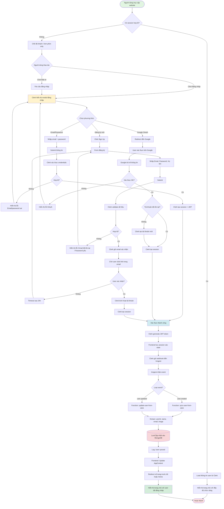
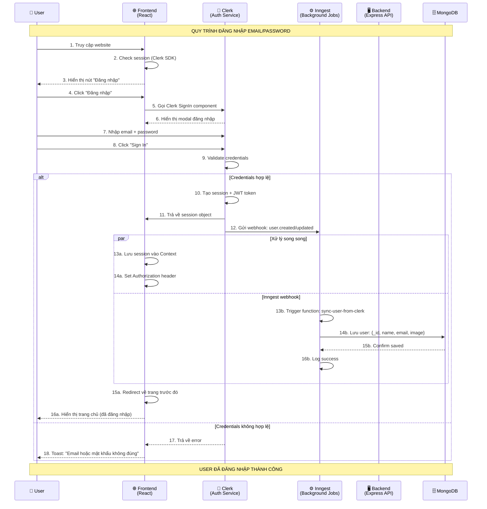
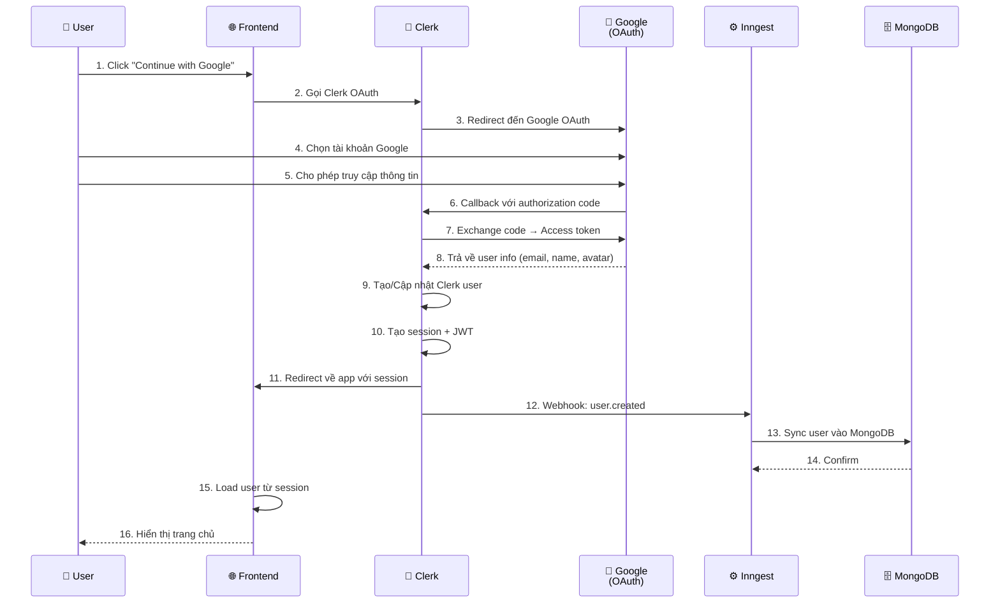
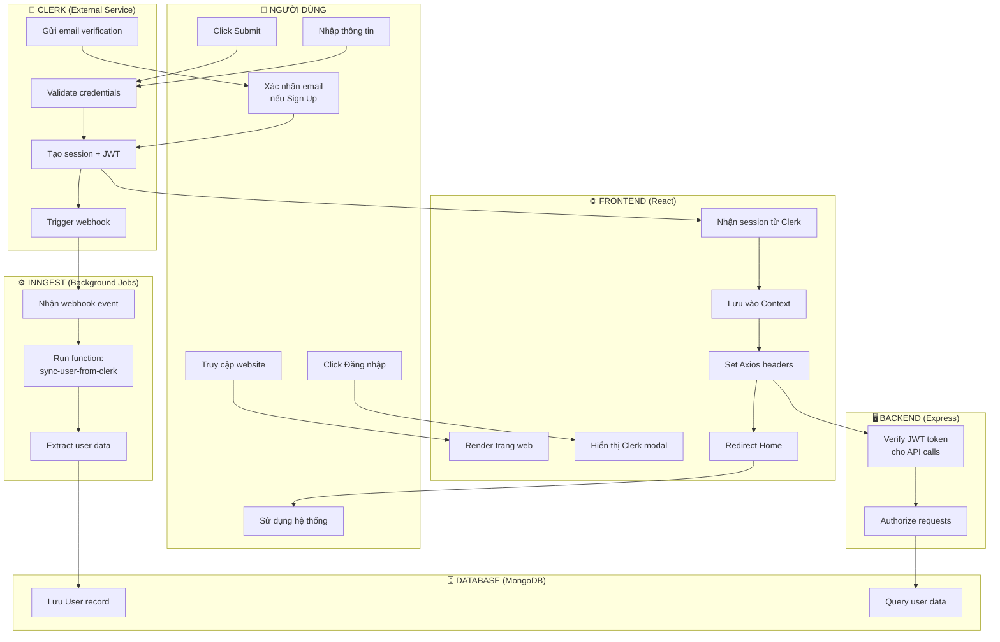

# 🔐 QUY TRÌNH ĐĂNG NHẬP HỆ THỐNG CHI TIẾT

## Hệ thống Đặt vé Xem phim QuickShow

---

## 📋 MỤC LỤC

1. [Tổng quan quy trình](#tổng-quan-quy-trình)
2. [Sơ đồ Activity Diagram](#sơ-đồ-activity-diagram)
3. [Sơ đồ Sequence Diagram](#sơ-đồ-sequence-diagram)
4. [Sơ đồ Swim Lane Diagram](#sơ-đồ-swim-lane-diagram)
5. [Mô tả chi tiết từng bước](#mô-tả-chi-tiết-từng-bước)
6. [Code minh họa](#code-minh-họa)
7. [Xử lý lỗi](#xử-lý-lỗi)
8. [Use Cases](#use-cases)

---

## 🎯 TỔNG QUAN QUY TRÌNH

### Mô tả chung

Hệ thống sử dụng **Clerk** - dịch vụ authentication bên thứ ba để xử lý toàn bộ quy trình đăng nhập, đăng ký và quản lý session. Backend Node.js chỉ đóng vai trò **verify JWT token** và **đồng bộ dữ liệu user** từ Clerk về MongoDB thông qua **Inngest webhooks**.

### Các thành phần tham gia

| Thành phần | Vai trò | Công nghệ |
|------------|---------|-----------|
| **Frontend** | Giao diện người dùng | React + Clerk React SDK |
| **Clerk** | Xác thực, quản lý user | Clerk Authentication Service |
| **Backend** | API server, verify token | Node.js + Express + Clerk Express SDK |
| **Inngest** | Xử lý webhook, background jobs | Inngest Cloud |
| **Database** | Lưu trữ user data | MongoDB Atlas |

### Các phương thức đăng nhập hỗ trợ

✅ **Email + Password**  
✅ **Google OAuth** (Continue with Google)  
✅ **Đăng ký mới** (Sign Up)

### Đặc điểm quan trọng

- ✅ **Không lưu password** trong database (Clerk xử lý)
- ✅ **Email verification** tự động (Clerk gửi email)
- ✅ **JWT token** để authenticate API calls
- ✅ **Session** tự động refresh (Clerk SDK)
- ✅ **Webhook** đồng bộ user real-time

---

## 📊 SƠ ĐỒ ACTIVITY DIAGRAM

### Quy trình đăng nhập/đăng ký hoàn chỉnh



---

## 🔄 SƠ ĐỒ SEQUENCE DIAGRAM

### Tương tác giữa các thành phần (Email/Password login)



### Tương tác cho Google OAuth



---

## 🏊 SƠ ĐỒ SWIM LANE DIAGRAM

### Phân chia trách nhiệm rõ ràng



---

## 📝 MÔ TẢ CHI TIẾT TỪNG BƯỚC

### BƯỚC 1: User truy cập website

**Frontend (React):**
```javascript
// App.jsx - Root component
import { ClerkProvider, SignedIn, SignedOut } from '@clerk/clerk-react';

function App() {
  return (
    <ClerkProvider publishableKey={import.meta.env.VITE_CLERK_PUBLISHABLE_KEY}>
      {/* Content */}
      <SignedOut>
        {/* Hiển thị nút đăng nhập */}
        <SignInButton />
      </SignedOut>
      
      <SignedIn>
        {/* Hiển thị nội dung cho user đã đăng nhập */}
        <UserButton />
      </SignedIn>
    </ClerkProvider>
  );
}
```

**Điều gì xảy ra:**
1. Clerk SDK tự động check session trong browser (localStorage/cookies)
2. Nếu có session hợp lệ → `<SignedIn>` render
3. Nếu không có → `<SignedOut>` render

---

### BƯỚC 2: User click "Đăng nhập"

**Frontend:**
```javascript
// Navbar.jsx
import { SignInButton, useUser } from '@clerk/clerk-react';

export default function Navbar() {
  const { isSignedIn, user } = useUser();
  
  return (
    <nav>
      {!isSignedIn && (
        <SignInButton mode="modal">
          <button>Đăng nhập</button>
        </SignInButton>
      )}
      
      {isSignedIn && (
        <div>
          Xin chào, {user.firstName}
        </div>
      )}
    </nav>
  );
}
```

**Điều gì xảy ra:**
- Click nút → Clerk hiển thị modal đăng nhập
- Modal có sẵn: Email/Password form, "Continue with Google"

---

### BƯỚC 3: User nhập thông tin và submit

**Clerk xử lý (không cần code):**
- Validate email format
- Validate password strength
- Hash password (bcrypt)
- Query Clerk database

---

### BƯỚC 4: Clerk xác thực thành công

**Clerk tạo session:**
```javascript
// Clerk tự động tạo:
{
  sessionId: "sess_abc123",
  userId: "user_2abc123xyz",
  status: "active",
  expireAt: "2025-01-10T10:00:00Z", // 7 ngày
  token: "eyJhbGciOiJSUzI1NiIsInR5cCI6IkpXVCJ9..." // JWT
}
```

**Frontend nhận session:**
```javascript
// AppContext.jsx
import { useAuth } from '@clerk/clerk-react';
import axios from 'axios';

export function AppProvider({ children }) {
  const { getToken, userId, isSignedIn } = useAuth();
  
  // Tạo axios instance với auth header
  const axiosInstance = axios.create({
    baseURL: import.meta.env.VITE_BASE_URL
  });
  
  // Interceptor: Tự động thêm token vào mọi request
  axiosInstance.interceptors.request.use(async (config) => {
    if (isSignedIn) {
      const token = await getToken();
      config.headers.Authorization = `Bearer ${token}`;
    }
    return config;
  });
  
  return (
    <AppContext.Provider value={{ axiosInstance, userId }}>
      {children}
    </AppContext.Provider>
  );
}
```

---

### BƯỚC 5: Clerk gửi webhook đến Inngest

**Clerk webhook event:**
```json
{
  "type": "user.created",
  "data": {
    "id": "user_2abc123xyz",
    "first_name": "Nguyễn",
    "last_name": "Văn A",
    "email_addresses": [
      {
        "email_address": "nguyenvana@example.com",
        "id": "email_abc"
      }
    ],
    "image_url": "https://img.clerk.com/...",
    "created_at": 1704024000000,
    "updated_at": 1704024000000
  }
}
```

---

### BƯỚC 6: Inngest đồng bộ user vào MongoDB

**Inngest Function:**
```javascript
// server/inngest/index.js
import { inngest } from './client';
import User from '../models/User.js';

export const syncUserFromClerk = inngest.createFunction(
  { id: 'sync-user-from-clerk' },
  { event: 'clerk/user.created' },
  async ({ event, step }) => {
    const { id, first_name, last_name, email_addresses, image_url } = event.data;
    
    return await step.run('create-user-in-db', async () => {
      const user = await User.create({
        _id: id,
        name: `${first_name} ${last_name}`,
        email: email_addresses[0].email_address,
        image: image_url,
        favoriteMovies: []
      });
      
      console.log('✅ User synced:', user.email);
      return user;
    });
  }
);
```

**MongoDB User document:**
```javascript
{
  _id: "user_2abc123xyz",
  name: "Nguyễn Văn A",
  email: "nguyenvana@example.com",
  image: "https://img.clerk.com/...",
  favoriteMovies: [],
  createdAt: ISODate("2025-01-01T10:00:00.000Z"),
  updatedAt: ISODate("2025-01-01T10:00:00.000Z")
}
```

---

### BƯỚC 7: Backend verify JWT cho API calls

**Middleware xác thực:**
```javascript
// server/middleware/auth.js
import { clerkClient } from '@clerk/clerk-sdk-node';

export const requireAuth = async (req, res, next) => {
  try {
    // Clerk Express middleware tự động parse JWT
    const { userId } = req.auth();
    
    if (!userId) {
      return res.status(401).json({
        success: false,
        message: 'Unauthorized - Please login'
      });
    }
    
    // Attach userId vào request
    req.userId = userId;
    next();
  } catch (error) {
    return res.status(401).json({
      success: false,
      message: 'Invalid token'
    });
  }
};
```

**Sử dụng middleware:**
```javascript
// server/routes/bookingRoutes.js
import { requireAuth } from '../middleware/auth.js';

router.post('/create', requireAuth, createBooking);
// → Chỉ user đã đăng nhập mới gọi được API này
```

---

### BƯỚC 8: Frontend redirect và hoàn tất

**React Router redirect:**
```javascript
// Sau khi Clerk xác thực xong
import { useNavigate } from 'react-router-dom';
import { useEffect } from 'react';
import { useUser } from '@clerk/clerk-react';

function LoginCallback() {
  const navigate = useNavigate();
  const { isLoaded, isSignedIn } = useUser();
  
  useEffect(() => {
    if (isLoaded && isSignedIn) {
      // Redirect về trang trước đó hoặc home
      const returnUrl = sessionStorage.getItem('returnUrl') || '/';
      navigate(returnUrl);
      sessionStorage.removeItem('returnUrl');
    }
  }, [isLoaded, isSignedIn]);
  
  return <Loading />;
}
```

---

## 💻 CODE MINH HỌA

### 1. Clerk Configuration (Frontend)

**File: `client/src/main.jsx`**
```javascript
import React from 'react';
import ReactDOM from 'react-dom/client';
import { ClerkProvider } from '@clerk/clerk-react';
import { BrowserRouter } from 'react-router-dom';
import App from './App';

const clerkPubKey = import.meta.env.VITE_CLERK_PUBLISHABLE_KEY;

ReactDOM.createRoot(document.getElementById('root')).render(
  <React.StrictMode>
    <ClerkProvider publishableKey={clerkPubKey}>
      <BrowserRouter>
        <App />
      </BrowserRouter>
    </ClerkProvider>
  </React.StrictMode>
);
```

---

### 2. Protected Route Example

**File: `client/src/components/ProtectedRoute.jsx`**
```javascript
import { useUser } from '@clerk/clerk-react';
import { Navigate } from 'react-router-dom';
import Loading from './Loading';

export default function ProtectedRoute({ children }) {
  const { isLoaded, isSignedIn } = useUser();
  
  if (!isLoaded) {
    return <Loading />;
  }
  
  if (!isSignedIn) {
    // Lưu URL hiện tại để redirect về sau khi login
    sessionStorage.setItem('returnUrl', window.location.pathname);
    return <Navigate to="/" replace />;
  }
  
  return children;
}
```

**Sử dụng:**
```javascript
// App.jsx
<Route 
  path="/seat-layout/:id/:date" 
  element={
    <ProtectedRoute>
      <SeatLayout />
    </ProtectedRoute>
  } 
/>
```

---

### 3. Backend Clerk Setup

**File: `server/server.js`**
```javascript
import express from 'express';
import { clerkMiddleware } from '@clerk/clerk-sdk-node';

const app = express();

// Clerk middleware - Parse JWT từ Authorization header
app.use(clerkMiddleware({
  publishableKey: process.env.CLERK_PUBLISHABLE_KEY,
  secretKey: process.env.CLERK_SECRET_KEY
}));

// Routes
app.use('/api/booking', bookingRoutes);
```

---

### 4. Admin Authorization Middleware

**File: `server/middleware/auth.js`**
```javascript
import { clerkClient } from '@clerk/clerk-sdk-node';

export const protectAdmin = async (req, res, next) => {
  try {
    const { userId } = req.auth();
    
    if (!userId) {
      return res.status(401).json({
        success: false,
        message: 'Unauthorized'
      });
    }
    
    // Lấy user từ Clerk để check role
    const user = await clerkClient.users.getUser(userId);
    
    if (user.privateMetadata?.role !== 'admin') {
      return res.status(403).json({
        success: false,
        message: 'Forbidden - Admin only'
      });
    }
    
    req.userId = userId;
    next();
  } catch (error) {
    return res.status(500).json({
      success: false,
      message: 'Server error'
    });
  }
};
```

**Sử dụng:**
```javascript
// server/routes/adminRoutes.js
router.get('/dashboard', protectAdmin, getDashboardData);
// → Chỉ admin mới truy cập được
```

---

### 5. Inngest Webhook Functions

**File: `server/inngest/index.js`**
```javascript
import { Inngest } from 'inngest';
import User from '../models/User.js';

const inngest = new Inngest({ 
  id: 'quickshow-app',
  eventKey: process.env.INNGEST_EVENT_KEY
});

// Function 1: Sync user mới
export const syncUserFromClerk = inngest.createFunction(
  { id: 'sync-user-from-clerk' },
  { event: 'clerk/user.created' },
  async ({ event }) => {
    const { id, first_name, last_name, email_addresses, image_url } = event.data;
    
    await User.create({
      _id: id,
      name: `${first_name} ${last_name}`,
      email: email_addresses[0].email_address,
      image: image_url
    });
    
    console.log('✅ User created:', id);
  }
);

// Function 2: Update user
export const updateUserFromClerk = inngest.createFunction(
  { id: 'update-user-from-clerk' },
  { event: 'clerk/user.updated' },
  async ({ event }) => {
    const { id, first_name, last_name, email_addresses, image_url } = event.data;
    
    await User.findByIdAndUpdate(id, {
      name: `${first_name} ${last_name}`,
      email: email_addresses[0].email_address,
      image: image_url
    });
    
    console.log('✅ User updated:', id);
  }
);

// Function 3: Delete user
export const deleteUserWithClerk = inngest.createFunction(
  { id: 'delete-user-with-clerk' },
  { event: 'clerk/user.deleted' },
  async ({ event }) => {
    const { id } = event.data;
    
    await User.findByIdAndDelete(id);
    
    console.log('✅ User deleted:', id);
  }
);

// Serve functions
export const inngestFunctions = [
  syncUserFromClerk,
  updateUserFromClerk,
  deleteUserWithClerk
];
```

**Serve Inngest endpoint:**
```javascript
// server/server.js
import { serve } from 'inngest/express';
import { inngestFunctions } from './inngest/index.js';

app.use(
  '/api/inngest',
  serve({
    client: inngest,
    functions: inngestFunctions
  })
);
```

---

## ⚠️ XỬ LÝ LỖI

### 1. Email đã tồn tại (Sign Up)

**Clerk tự động xử lý:**
```javascript
// Frontend: Clerk component tự động hiển thị lỗi
<SignUp />
// → Nếu email đã tồn tại, Clerk hiển thị:
// "That email address is taken. Please try another."
```

---

### 2. Sai email/password (Sign In)

**Xử lý lỗi:**
```javascript
// Clerk tự động hiển thị:
// "Couldn't find your account or password is incorrect"

// Frontend có thể custom error message:
import { useSignIn } from '@clerk/clerk-react';

function CustomSignIn() {
  const { signIn, setActive } = useSignIn();
  const [error, setError] = useState('');
  
  const handleSubmit = async (e) => {
    e.preventDefault();
    try {
      const result = await signIn.create({
        identifier: email,
        password: password
      });
      
      if (result.status === 'complete') {
        await setActive({ session: result.createdSessionId });
      }
    } catch (err) {
      setError('Email hoặc mật khẩu không đúng');
    }
  };
}
```

---

### 3. Token hết hạn

**Auto-refresh:**
```javascript
// Clerk SDK tự động refresh token trước khi hết hạn
// Không cần code gì thêm

// Nếu token thực sự expired (user offline lâu):
const { getToken } = useAuth();

try {
  const token = await getToken(); // Auto-refresh nếu cần
  // Sử dụng token...
} catch (error) {
  // Token không thể refresh → Yêu cầu login lại
  signOut();
  navigate('/');
}
```

---

### 4. Network error

**Retry logic:**
```javascript
// Axios interceptor
axiosInstance.interceptors.response.use(
  response => response,
  async error => {
    if (error.code === 'ERR_NETWORK') {
      // Retry 3 lần
      const config = error.config;
      config.__retryCount = config.__retryCount || 0;
      
      if (config.__retryCount < 3) {
        config.__retryCount++;
        await new Promise(resolve => setTimeout(resolve, 1000));
        return axiosInstance(config);
      }
      
      toast.error('Không thể kết nối đến server');
    }
    return Promise.reject(error);
  }
);
```

---

### 5. Webhook failed (Inngest)

**Auto-retry:**
```javascript
// Inngest tự động retry failed functions:
// - Retry 1: Sau 1 giây
// - Retry 2: Sau 2 giây
// - Retry 3: Sau 4 giây
// - Retry 4: Sau 8 giây
// - Retry 5: Sau 16 giây
// → Tối đa 5 lần

// Nếu vẫn fail → Inngest dashboard sẽ hiển thị error
// Admin có thể manually retry hoặc debug
```

---

## 📖 USE CASES

### Use Case 1: Đăng nhập bằng Email/Password

**Actor:** Người dùng  
**Precondition:** User đã có tài khoản  
**Postcondition:** User đăng nhập thành công và có thể đặt vé

**Main Flow:**
1. User click "Đăng nhập"
2. Clerk hiển thị modal
3. User nhập email + password
4. User click "Sign In"
5. Clerk xác thực thông tin
6. Clerk tạo session + JWT
7. Frontend lưu session
8. Clerk gửi webhook đến Inngest
9. Inngest đồng bộ user vào MongoDB
10. Frontend redirect về trang chủ

**Alternative Flow 5a: Email/password sai**
- 5a1. Clerk hiển thị lỗi
- 5a2. Return to step 3

---

### Use Case 2: Đăng nhập bằng Google

**Actor:** Người dùng  
**Precondition:** User có tài khoản Google  
**Postcondition:** User đăng nhập và tài khoản được tạo (nếu chưa có)

**Main Flow:**
1. User click "Continue with Google"
2. Redirect đến Google OAuth
3. User chọn tài khoản Google
4. User cho phép truy cập thông tin
5. Google redirect về Clerk với authorization code
6. Clerk exchange code → Access token
7. Clerk lấy user info từ Google
8. Nếu chưa có tài khoản → Clerk tạo mới
9. Clerk tạo session
10. Webhook đồng bộ vào MongoDB
11. Redirect về app

**Alternative Flow 4a: User từ chối**
- 4a1. Google trả về error
- 4a2. Clerk hiển thị lỗi
- 4a3. Return to login modal

---

### Use Case 3: Đăng ký tài khoản mới

**Actor:** Người dùng mới  
**Precondition:** Không có  
**Postcondition:** Tài khoản được tạo và kích hoạt

**Main Flow:**
1. User click "Sign Up"
2. User nhập Email, Password, Họ tên
3. User click "Sign Up"
4. Clerk validate dữ liệu
5. Clerk gửi email xác nhận
6. User check email và click link
7. Clerk kích hoạt tài khoản
8. Clerk tạo session
9. Webhook đồng bộ vào MongoDB
10. Redirect về trang chủ

**Alternative Flow 4a: Email đã tồn tại**
- 4a1. Clerk hiển thị: "Email already exists"
- 4a2. Return to step 2

**Alternative Flow 4b: Password yếu**
- 4b1. Clerk hiển thị: "Password must be at least 8 characters"
- 4b2. Return to step 2

**Alternative Flow 6a: User không xác nhận email trong 24h**
- 6a1. Clerk xóa unverified account
- 6a2. User phải đăng ký lại

---

### Use Case 4: Đăng xuất

**Actor:** Người dùng đã đăng nhập  
**Precondition:** User đã đăng nhập  
**Postcondition:** Session bị xóa, user về chế độ guest

**Main Flow:**
1. User click "Đăng xuất"
2. Frontend gọi `signOut()` từ Clerk SDK
3. Clerk xóa session
4. Frontend clear context
5. Redirect về trang chủ

**Code:**
```javascript
import { useClerk } from '@clerk/clerk-react';

function LogoutButton() {
  const { signOut } = useClerk();
  
  const handleLogout = async () => {
    await signOut();
    navigate('/');
  };
  
  return <button onClick={handleLogout}>Đăng xuất</button>;
}
```

---

## 🔐 BẢO MẬT

### 1. JWT Token Security

**Cách Clerk protect JWT:**
- ✅ Algorithm: RS256 (RSA asymmetric)
- ✅ Expiration: 1 giờ
- ✅ Auto-refresh trước khi hết hạn
- ✅ Signed bằng private key của Clerk
- ✅ Backend verify bằng public key

**Token structure:**
```json
{
  "alg": "RS256",
  "typ": "JWT"
}
.
{
  "azp": "http://localhost:5173",
  "exp": 1704027600,
  "iat": 1704024000,
  "iss": "https://clerk.quickshow.com",
  "nbf": 1704023940,
  "sid": "sess_abc123",
  "sub": "user_2abc123xyz"
}
.
<signature>
```

---

### 2. Password Security

**Clerk xử lý:**
- ✅ Min 8 characters
- ✅ Bcrypt hashing (cost factor: 10)
- ✅ Không lưu plaintext password
- ✅ Password reset qua email

**User không thể:**
- ❌ Sử dụng password quá đơn giản (123456, password, etc.)
- ❌ Tái sử dụng password cũ
- ❌ Xem password của người khác

---

### 3. Session Security

**Features:**
- ✅ HttpOnly cookies (không truy cập được qua JavaScript)
- ✅ Secure flag (chỉ gửi qua HTTPS)
- ✅ SameSite: Lax (chống CSRF)
- ✅ Auto-expire sau 7 ngày
- ✅ Multi-device support (có thể đăng nhập nhiều thiết bị)

---

### 4. API Security

**Backend validation:**
```javascript
// Mọi protected route đều verify JWT
app.use('/api/booking', clerkMiddleware(), bookingRoutes);

// Double-check trong controller
export const createBooking = async (req, res) => {
  const { userId } = req.auth();
  
  if (!userId) {
    return res.status(401).json({ message: 'Unauthorized' });
  }
  
  // Verify user exists in DB
  const user = await User.findById(userId);
  if (!user) {
    return res.status(404).json({ message: 'User not found' });
  }
  
  // Continue...
};
```

---

## 🎓 TÓM TẮT

### ✅ Điểm mạnh của quy trình

1. **Bảo mật cao**: Clerk xử lý toàn bộ authentication, không tự code JWT
2. **UX tốt**: Modal đẹp, OAuth đơn giản, auto-redirect
3. **Maintainable**: Không phải lo update security patches
4. **Scalable**: Clerk xử lý được millions users
5. **Real-time sync**: Webhook đồng bộ ngay lập tức

### ⚠️ Lưu ý quan trọng

1. **Clerk là dịch vụ trả phí** (Free tier: 5000 MAUs)
2. **Phụ thuộc vào third-party** (nếu Clerk down → không login được)
3. **Cần config webhook đúng** (Inngest endpoint phải public)
4. **JWT có expiration** (1 giờ, cần refresh)

---

## 📚 TÀI LIỆU THAM KHẢO

- [Clerk Documentation](https://clerk.com/docs)
- [Inngest Documentation](https://www.inngest.com/docs)
- [JWT.io](https://jwt.io/)
- [OAuth 2.0 Simplified](https://www.oauth.com/)

---

**© 2025 QuickShow - Movie Ticket Booking System**

*Tài liệu này được tạo cho mục đích báo cáo LVTN*


