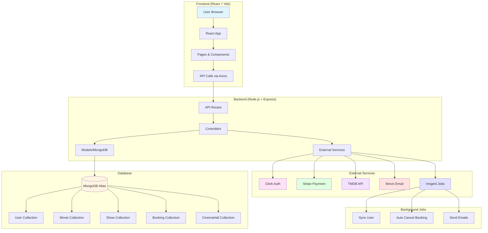
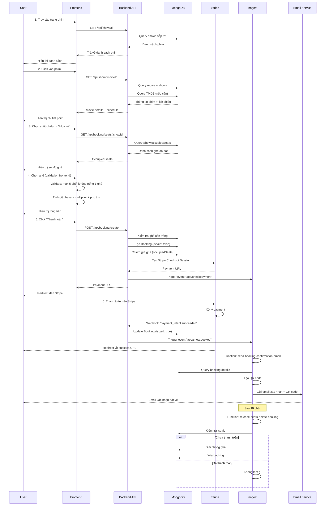
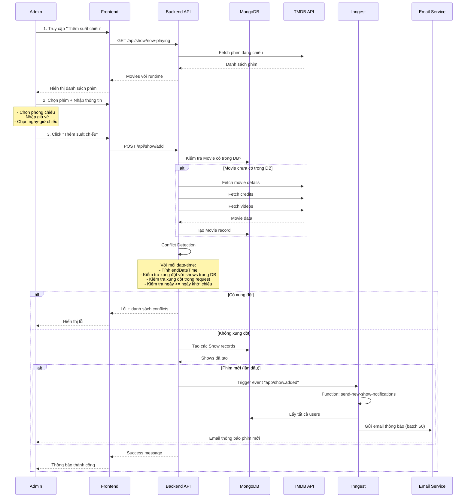
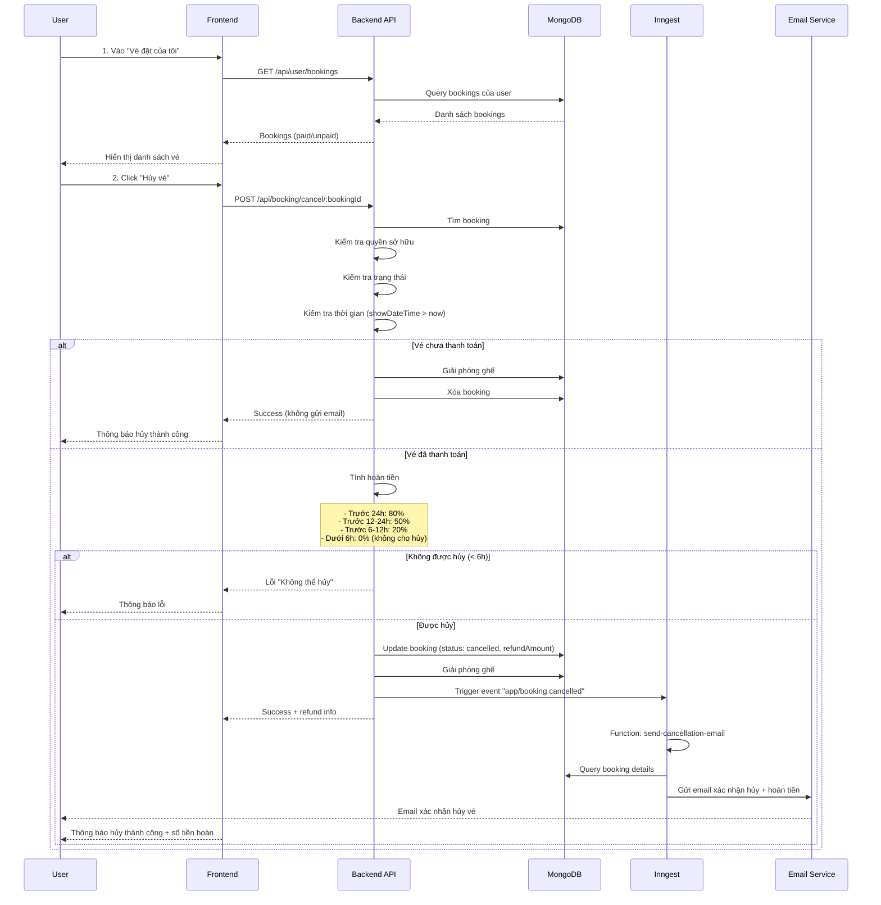
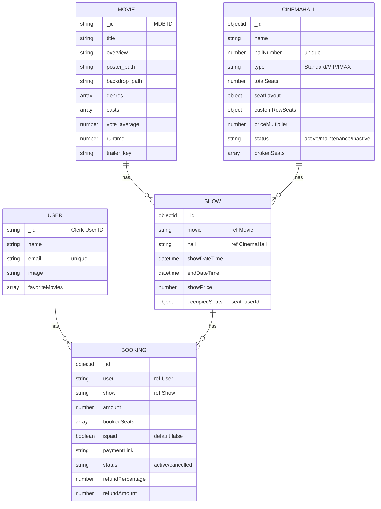
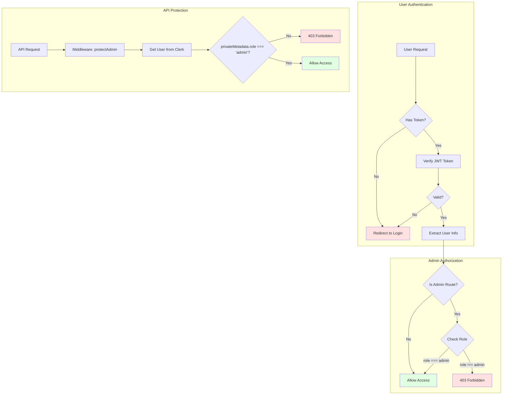
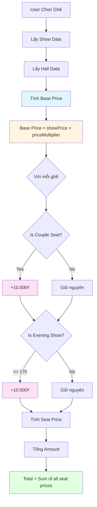
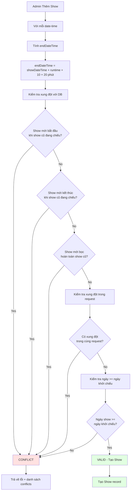
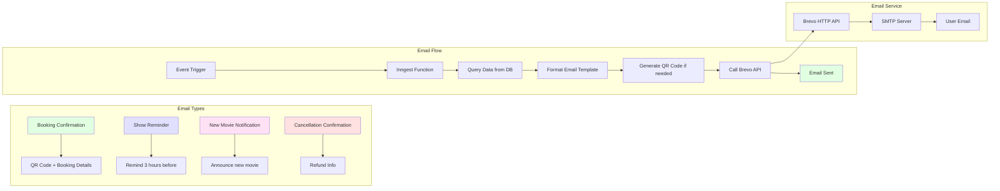

# 📊 SƠ ĐỒ MINH HỌA LUỒNG HOẠT ĐỘNG HỆ THỐNG

## 🎯 TỔNG QUAN

Tài liệu này chứa các sơ đồ minh họa luồng hoạt động của hệ thống đặt vé xem phim, được vẽ bằng Mermaid diagram syntax.

---

## 1. 📐 SƠ ĐỒ KIẾN TRÚC TỔNG QUAN HỆ THỐNG

---

## 2. 🔄 SƠ ĐỒ LUỒNG ĐẶT VÉ VÀ THANH TOÁN

---

## 3. 👨‍💼 SƠ ĐỒ LUỒNG ADMIN THÊM SUẤT CHIẾU

---

## 4. 🔄 SƠ ĐỒ LUỒNG HỦY VÉ

---

## 5. 🔄 SƠ ĐỒ LUỒNG BACKGROUND JOBS

```mermaid
graph TB
    subgraph "User Sync (Clerk Webhooks)"
        A[Clerk User Created] --> B[Inngest: sync-user-from-clerk]
        B --> C[Create User in MongoDB]
        
        D[Clerk User Updated] --> E[Inngest: update-user-from-clerk]
        E --> F[Update User in MongoDB]
        
        G[Clerk User Deleted] --> H[Inngest: delete-user-with-clerk]
        H --> I[Delete User from MongoDB]
    end
    
    subgraph "Auto Cancel Booking"
        J[Booking Created] --> K[Trigger: app/checkpayment]
        K --> L[Inngest: release-seats-delete-booking]
        L --> M{Wait 10 minutes}
        M --> N{Check ispaid?}
        N -->|false| O[Release Seats]
        O --> P[Delete Booking]
        N -->|true| Q[Do Nothing]
    end
    
    subgraph "Email Notifications"
        R[Payment Success] --> S[Trigger: app/show.booked]
        S --> T[Inngest: send-booking-confirmation-email]
        T --> U[Generate QR Code]
        U --> V[Send Email with QR]
        
        W[Cron: Every 1 hour] --> X[Inngest: send-show-reminders]
        X --> Y[Find Shows in 3 hours]
        Y --> Z[Send Reminder Emails]
        
        AA[New Movie Added] --> AB[Trigger: app/show.added]
        AB --> AC[Inngest: send-new-show-notifications]
        AC --> AD[Get All Users]
        AD --> AE[Send Batch Emails 50/batch]
        
        AF[Booking Cancelled] --> AG[Trigger: app/booking.cancelled]
        AG --> AH[Inngest: send-cancellation-email]
        AH --> AI[Send Cancellation Email]
    end
    
    style A fill:#ffe1f5
    style D fill:#ffe1f5
    style G fill:#ffe1f5
    style J fill:#e1ffe1
    style R fill:#e1ffe1
    style W fill:#e1e1ff
    style AA fill:#e1e1ff
    style AF fill:#ffe1e1
```

---

## 6. 🏗️ SƠ ĐỒ KIẾN TRÚC DỮ LIỆU (Database Schema)

---

## 7. 🔐 SƠ ĐỒ XÁC THỰC VÀ PHÂN QUYỀN

---

## 8. 💰 SƠ ĐỒ TÍNH GIÁ VÉ

---

## 9. ⚠️ SƠ ĐỒ CONFLICT DETECTION

---

## 10. 📧 SƠ ĐỒ HỆ THỐNG EMAIL

---

## 📊 **HƯỚNG DẪN XEM SƠ ĐỒ**

### Cách xem sơ đồ:
1. **Trong GitHub/GitLab**: Sơ đồ Mermaid sẽ tự động render
2. **Trong VS Code**: Cài extension "Markdown Preview Mermaid Support"
3. **Online**: Copy code vào [Mermaid Live Editor](https://mermaid.live/)

### Ký hiệu trong sơ đồ:
- **Hình chữ nhật**: Process/Function
- **Hình thoi**: Decision/Condition
- **Hình tròn**: Start/End
- **Mũi tên**: Flow direction
- **Màu sắc**: Phân loại module

---

*Tài liệu này chứa các sơ đồ minh họa đầy đủ luồng hoạt động của hệ thống đặt vé xem phim.*

