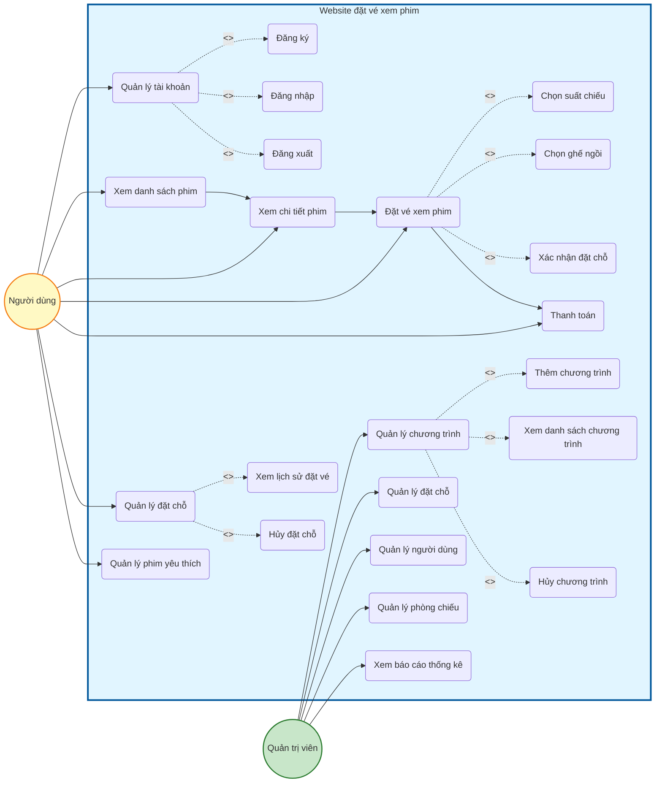
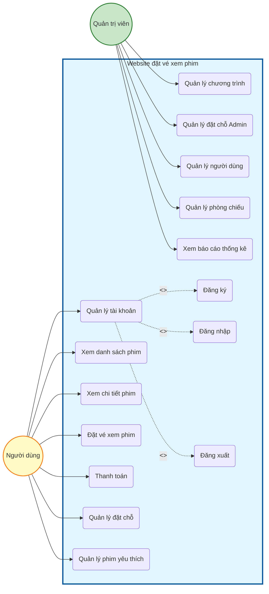

# Sơ đồ Use Case - Website đặt vé xem phim

## Sơ đồ Use Case đầy đủ (Mermaid)

## Sơ đồ Use Case đơn giản hóa (giống hình mẫu)

## Mô tả các Use Case:

### Người dùng (User):
1. **Quản lý tài khoản** - Quản lý thông tin tài khoản
   - Đăng ký
   - Đăng nhập
   - Đăng xuất
2. **Xem danh sách phim** - Xem danh sách phim đang chiếu và sắp chiếu
3. **Xem chi tiết phim** - Xem thông tin chi tiết, trailer, lịch chiếu
4. **Đặt vé xem phim** - Đặt vé cho suất chiếu
   - Chọn suất chiếu
   - Chọn ghế ngồi
   - Xác nhận đặt chỗ
5. **Thanh toán** - Thanh toán vé đã đặt
6. **Quản lý đặt chỗ** - Quản lý các đặt chỗ của mình
   - Xem lịch sử đặt vé
   - Hủy đặt chỗ
7. **Quản lý phim yêu thích** - Thêm/xóa phim yêu thích

### Quản trị viên (Admin):
8. **Quản lý chương trình** - Quản lý các suất chiếu
   - Thêm chương trình
   - Xem danh sách chương trình
   - Hủy chương trình
9. **Quản lý đặt chỗ** - Xem và quản lý tất cả đặt chỗ
10. **Quản lý người dùng** - Xem danh sách người dùng
11. **Quản lý phòng chiếu** - Quản lý các phòng chiếu
12. **Xem báo cáo thống kê** - Xem dashboard với thống kê doanh thu, đặt chỗ

